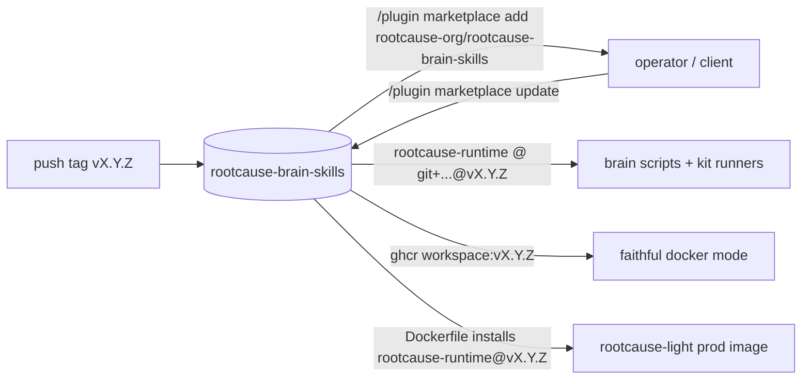

# rootcause-brain-skills — SPEC

**One repo that lets anyone (us today, external clients later) iterate on a project's BRAIN locally
and verify it works the way production does — distributed as a Claude Code plugin + a pinned Python
package, with zero access to the `rootcause-light` host source.**

This is a build spec, not durable design — delete it once implemented (the code + the shipped
`SKILL.md` are the only durable record). Terminology follows the `rootcause-light` taxonomy
(**brain**, **mirror**, **workspace**, **journal**, **run**).

---

## 1. Why

A brain is `rootcause-org/rootcause-brain-<project>` — markdown skills + Python grounding scripts that
do `from lib import db`. Today you can only really exercise a brain *on the Frankfurt box* (a real
run) or via ad-hoc local scripts that reach into a `rootcause-light` checkout. Problems:

- **External clients won't have `rootcause-light` source** — yet they must be able to iterate on their
  own brain and trust that "works locally" ⇒ "works in prod".
- **`lib` is the hidden coupling.** Brain scripts import it; in prod it's baked into the workspace
  Docker image; locally it's found via a `rootcause-light` path. That coupling must be broken cleanly,
  without creating a second copy of `lib` that drifts from prod.
- **Skill drift.** A test/iterate skill copied into every brain rots. It should be installed once and
  run against whatever brain you're in.

Goal: a single, versioned, installable kit — **skill + engine + the `lib` package** — that makes the
local brain-dev loop faithful and frictionless.

---

## 2. Scope — what ships here vs. what stays in `rootcause-light`

Three buckets of existing tooling; only **A** ships in this repo.

| Bucket | Examples (today's location) | Ships to clients? | Home |
|---|---|---|---|
| **A — brain-author / test** | `brain_run.py`, `brain_test.py` (`rootcause-light/.agents/skills/support/scripts` + `scripts/`) | **Yes** | **this repo** |
| **B — operator host-debug** | `db.py`, `health.py`, `logs.py`, `rc_agent_debug.py`, `rc_thread_debug.py`, `runs_digest.py`, `run_patterns.py`, `rc_status_url.py`, `rc_trace_url.py`, `rc_sync_brain.sh`, `rc_agent_run.sh` | **Never** (query OUR host store / SSM / our CloudWatch) | stays in `rootcause-light` |
| **C — operator key/env plumbing** | `rc_secret.py`, `rc_env.py` (`--pull`/`--verify`), `rc_run_locally.py` | **Never** (read `accounts.yml`, decrypt the box's sealed env over SSM) | stays in `rootcause-light` |

Litmus test: *does it touch our host (Postgres registry / River / `run_events` / `egress_log` /
Frankfurt CloudWatch / the box over SSM)?* If yes → bucket B/C → never leaves `rootcause-light`. The
two bucket-A scripts are the only ones that are infra-free and customer-world-facing.

**Engine = bucket A, rebuilt to be brain-dir-relative and `accounts.yml`-free.** Operator wrappers in
`rootcause-light` (bucket C) may *call* the engine; never the reverse.

---

## 3. The two distribution concerns (keep them separate)

The skill is the easy 10%. The load-bearing decision is decoupling `lib`. They distribute differently:

| Concern | What it is | Mechanism | Update |
|---|---|---|---|
| **Skill + engine** | `SKILL.md` + runner scripts | **Claude Code plugin marketplace** (`.claude-plugin/marketplace.json`) | `/plugin marketplace update` |
| **`lib` (`rootcause-runtime`)** | the Python helpers brain scripts import | **pinned Python package** (`pyproject.toml`, consumed by git tag) | bump the tag |

> **The trap to avoid:** a repo split fixes *skill* drift but, if `lib` is copied/vendored here,
> creates *`lib`* drift — and that's worse, because a green local test against a stale `lib` is a
> *false* green. `lib` must have exactly ONE source of truth.

### 3.1 `lib` single source of truth (the critical step)

`runtime/lib` currently lives in `rootcause-light` and is the same code baked into the prod workspace
image (`runtime/Dockerfile`). Make it a package that **both** consumers install by the same pin:

- **prod** — `rootcause-light/runtime/Dockerfile` installs `rootcause-runtime@<pin>` instead of
  `COPY runtime/lib`.
- **local** — the kit's runners + a brain's own scripts depend on the same `rootcause-runtime@<pin>`.

Because both install identical versioned bytes, "tested locally" provably equals "runs in prod".

Decision to record: **where does `rootcause-runtime` physically live?**
- *Recommended:* canonical here (`rootcause-brain-skills`), prod Dockerfile consumes it from here.
- *Alternative:* keep `lib` in `rootcause-light`, publish it to a registry, both consume the published
  artifact. (Avoids moving code; adds a publish step.)

Either way: **one canonical copy, pinned by tag** — `git+https://github.com/rootcause-org/rootcause-brain-skills@vX.Y.Z#subdirectory=...` or a registry version.

---

## 4. The two run modes (required)

The kit must offer both. They trade fidelity for speed.

### 4.1 Fast `uv` mode — the inner loop

`uv run` the script with `rootcause-runtime` + deps, env from the brain's `./.env`, `PYTHONPATH` =
runtime (for `lib`) + the script's own dir (for siblings), and a hard `import lib.db` preflight (so a
brain's `try/except` guard can't fail silently as `db = None`).

- **Reproduces:** the import surface (`from lib import db`), the per-project env, read-only DB
  grounding, brain-script execution, the brain pytest tiers.
- **Does NOT reproduce:** the egress allowlist (locally you have open internet — a call that passes
  here can be `EGRESS_BLOCKED` in prod), the `:ro` mounts (`EROFS`), container isolation, the exact
  pinned dep set, or the `/mirrors` layout. **A green `uv`-mode run ≠ a guaranteed-green prod run.**
- **Use for:** tight iteration while writing/fixing a skill script.

### 4.2 Faithful `docker` mode — the pre-push check

`docker run` the **published workspace image** (the same image prod uses), mounting the brain at
`/brain:ro` and mirrors at `/mirrors/<name>:ro`, injecting `./.env`, then exec the script/tests.

- **Reproduces:** the exact dep set (the image), `:ro` mounts + `EROFS`, the `/mirrors` layout,
  non-root/cap-dropped isolation — i.e. prod minus the host orchestration. *(Egress-firewall parity is
  an optional advanced add-on via the privileged sidecar; default docker mode leaves egress open and
  says so.)*
- **Requires:** the workspace image **published to a registry** (e.g. `ghcr.io/rootcause-org/workspace:<tag>`)
  so clients pull it with **no `rootcause-light` source**. Pin the image tag to match the
  `rootcause-runtime` pin.
- **Use for:** "does this actually work in the box?" before pushing the brain.

> Publishing the workspace image is a sibling requirement to packaging `lib`: both are what let a
> client reproduce prod without our source.

---

## 5. The skill — brain-dir-relative, installed once

- **Installed once at user scope; run from inside any brain.** You `cd` into
  `rootcause-brain-<project>` and invoke the skill; it operates on `.` — reads `./.env`, `./dev/`,
  `./skills/*/scripts/`. **It is NOT copied into each brain** (that's the drift we're killing). Only
  *project-specific test fixtures* live in the brain.
- **Zero-config:** no `accounts.yml`, no project name, no `code_root`. The brain dir is the cwd; the
  env is `./.env`. (This is `brain_run.py`'s model, not `rc_run_locally.py`'s operator model.)
- **What it does:** brief (map the brain: env key names, DBs, mirrors, skills) → run a chosen
  grounding script or the test tiers, in either mode → report grounded result + caveats.
- **Read-only / no side effects**, exactly like a real run: never writes the brain, never posts a
  callback, never hits the box. (Podio write only where a self-owned project legitimately allows it.)
- **Lives at the plugin root, NOT under a brain's `skills/`.** Anything under `<brain>/skills/`
  becomes the *agent's* runtime knowledge surface; a dev/test harness there would pollute real runs.

---

## 6. Repo layout

```
rootcause-brain-skills/
├── .claude-plugin/
│   └── marketplace.json        # catalog: lists this plugin (name, source, version)
├── plugin.json                 # plugin manifest (name, version, description)
├── skills/
│   └── brain-dev/
│       └── SKILL.md            # the brain-dev/test skill (frontmatter: name + description)
├── commands/                   # optional slash command(s) wrapping the skill
├── scripts/                    # the ENGINE (bucket A, brain-dir-relative)
│   ├── brain_env.py            # shared core: load ./.env, PYTHONPATH, deps, import-lib.db preflight
│   ├── brain_run.py            # run one brain script/module — uv mode + docker mode
│   └── brain_test.py           # pytest tiers (offline L1 · live L2 schema · L3 render) — both modes
├── runtime/                    # the rootcause-runtime PACKAGE (lib), if canonical here
│   ├── pyproject.toml          # name = "rootcause-runtime", version = vX.Y.Z
│   └── lib/                    # db, stripe, cloudwatch, fs, http, html, livecheck, _output
├── docker/
│   └── Dockerfile              # the workspace image (or reference the published tag)
├── pyproject.toml              # (if packaging lib at repo root instead of runtime/)
├── SPEC.md                     # this file (delete after build)
└── README.md
```

Plugin conventions (Claude Code): component dirs (`skills/`, `commands/`, `scripts/`) sit at the
plugin root, **not** inside `.claude-plugin/`; kebab-case names; a `SKILL.md` needs YAML frontmatter
with a `description` so the model knows when to use it.

---

## 7. Distribution & versioning flow



- **Skill:** `/plugin marketplace add rootcause-org/rootcause-brain-skills` then `/plugin install`;
  refresh with `/plugin marketplace update` (this is the "GitHub link + repull" model — native).
- **`lib`:** depend on `rootcause-runtime@vX.Y.Z` — **always pin a tag, never float `main`** (a push
  would silently break clients' local tests).
- **Image:** pin `ghcr.io/rootcause-org/workspace:vX.Y.Z`.
- **Single version line:** the plugin tag, the `rootcause-runtime` pin, the image tag, and the prod
  Dockerfile pin should move together so local and prod can't diverge.

---

## 8. `.env` convention (do this)

Standardize every brain on a single gitignored **`.env`** at the brain root (the box already stores it
as `.env` at `/srv/brain/projects/<project>/.env`; the engine reads `./.env`).

- **Action:** rename `rootcause-brain-momentum-tools/.env.rootcause-prompt-api` → `.env`. Safe: the
  brain `.gitignore` already ignores `.env` and `.env.*`. One file holds DSNs + API keys; drop the
  multi-file merge complexity.
- Recovery for operators stays in `rootcause-light` (`rc_env.py --pull`, bucket C).

---

## 9. Caveats / decisions to honor

- **Private-repo auth is friction for real clients.** Plugin install + `uv` git-deps from a *private*
  repo need the client's git/SSH or a token. Fine for us + a granted pilot. For arms-length clients,
  plan a **public marketplace + a real package registry** (PyPI / private index) — later, not now.
- **Marketplace = trust/governance layer.** Installing a plugin runs its code fully trusted; keep
  write access to this repo tight.
- **`lib.fs` hardcodes `/mirrors`.** Docker mode satisfies it (mount there). `uv` mode needs a
  `RC_MIRRORS_ROOT` override (small `lib` change) or a symlink farm; document that source navigation
  in `uv` mode may be limited if mirrors aren't laid out at `/mirrors`.
- **Mirrors may be absent locally.** A client may not clone every source mirror; the runner must
  degrade gracefully and say which mirror is missing.
- **`uv`-mode fidelity gap is real** (§4.1) — surface it in the skill output so nobody over-trusts a
  green inner-loop run; the docker mode is the honest pre-push gate.

---

## 10. Build sequence

1. **Package `lib` → `rootcause-runtime`** (`pyproject.toml`, pick canonical home per §3.1). Prove
   `uv run --with "rootcause-runtime @ git+...@<tag>" python -c "import lib.db"` works.
2. **Repoint prod** — `rootcause-light/runtime/Dockerfile` installs `rootcause-runtime@<pin>` instead
   of `COPY runtime/lib`; confirm a prod run still grounds. *(This is the make-or-break step — do it
   before building the skill.)*
3. **Publish the workspace image** to a registry, pinned tag.
4. **Build the engine** — `brain_env.py` (shared core) + `brain_run.py` + `brain_test.py`,
   brain-dir-relative, `accounts.yml`-free, supporting **both** modes (§4).
5. **Write the plugin** — `marketplace.json`, `plugin.json`, `skills/brain-dev/SKILL.md`.
6. **Standardize `.env`** (§8); rename momentum's file.
7. **Migrate `rootcause-light`** — delete the bucket-A copies (`brain_run.py`/`brain_test.py`); point
   the support skill at the kit; leave buckets B/C in place; operator wrappers call the engine.
8. **Dogfood** on `rootcause-brain-momentum-tools`, then document the client onboarding (`add ->
   install -> cd brain -> run`).

**Definition of done:** from a brain repo with only `.env` + the installed plugin (no `rootcause-light`
source), both `uv` and `docker` modes run a grounding script and the live test tier read-only against
prod, and the `rootcause-runtime`/image pins match what prod runs.
