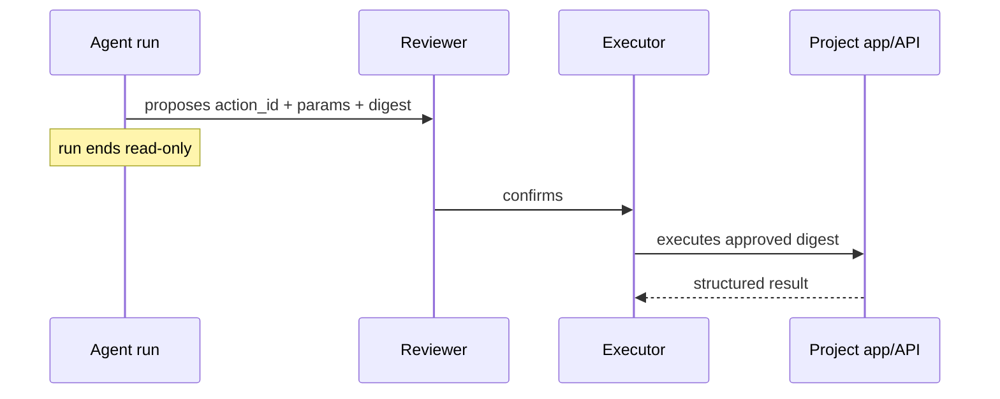

# Actions

Everything else in a brain is read-only diagnosis. An action is the deliberate state-changing plane:
the run proposes vetted params, a human confirms later, and only then does the executor run the
approved digest.

Read [docs/side-effects.md](side-effects.md) before reporting action results.

## Product Flow



A draft that says "booked", "cancelled", or "refunded" is not proof of mutation. Check the action
lifecycle: preflight blocked, proposed and pending, confirmed/executed, or failed.

## Brain Layout

```text
actions/<id>/
  manifest.yaml
  script.rb | script.py
  preflight.py
```

- `manifest.yaml` describes the action, param schema, and any hosted write connections.
- `preflight.py`, when present, is read-only and blocks unsafe/mis-grounded params before proposal.
- `script.rb` is customer-hosted Embassy mode.
- `script.py` is hosted Python mode and should use `lib.action`.

Action docs/runbooks should put exact safety guards and verification checks near the top: required
evidence, disqualifying states, preflight expectations, post-execution proof, and when to refuse or
escalate.

## Hosted Python Harness

Hosted Python actions import the baked runtime harness instead of hand-rolling params, result files,
credential lookup, HTTP retries, and error envelopes.

```python
#!/usr/bin/env python3
from lib import action
from lib.action import googledrive, notion

p = action.params()
f = p.file("attachment")

uploaded = googledrive.upload_file(folder_id=p["folder_id"], file=f)
page = notion.append_file_link(page_id=p["page_id"], title=f.filename, url=uploaded.web_url)

action.ok(
    f"Saved **{f.filename}** to Drive and linked it on the Notion page.",
    {"drive_file_id": uploaded.id, "notion_page_id": page.id},
)
```

`action.params()` reads `$RC_ACTION_PARAMS` and installs crash capture. `p["name"]` is required;
`p.get("name")` is optional. `p.file("attachment")` returns a `FileParam` with `path`, `filename`,
`mime_type`, `size_bytes`, `attachment_id`, plus `open()` and `read_bytes()`.

`action.ok(summary, data)` writes the success Result to `$RC_ACTION_RESULT`, prints it, and exits.
`action.fail(summary, data)` is a handled negative: the executor worked, but the reviewer should not
send the optimistic draft. `raise action.ActionError("message")` is a hard handled failure without a
Python backtrace. Any other uncaught exception is captured with a backtrace in the Result file.

Function style is also supported:

```python
from lib import action

@action.main
def run(p):
    return {"summary": "Done.", "id": p["id"]}
```

## Write Connections

Hosted OAuth/API writes go through `lib.action.client("<capability>")` or provider helpers under
`lib.action.*`. For brokered write connections, action code should not read env vars directly.

```yaml
connections:
  - googledrive.write
  - notion.write
```

`action.client("notion.write")` resolves only `RC_ACTION_NOTION`, never `RC_CONN_NOTION`, and returns
a `lib.api.Client` with write verbs enabled. Missing credentials fail closed with guidance to declare
the capability and connect a write grant (`label=actions`). Read connectors under `lib.connectors.*`
remain read-only and `RC_CONN_*`-backed.

Available provider helpers are intentionally small and grown as actions need them:

- `lib.action.googledrive.upload_file(folder_id=..., file=...)`
- `lib.action.notion.append_file_link(page_id=..., title=..., url=...)`
- `lib.action.notion.create_page(parent_id=..., title=..., properties=...)`
- `lib.action.notion.update_properties(page_id=..., properties=...)`

One-off write calls can use the generic client:

```python
from lib import action

c = action.client("linear.write")
c.post("issues", json={"title": "Customer follow-up"}, idempotency_key="issue-123")
```

Write requests are not retried blindly. Passing `idempotency_key=` sets the `Idempotency-Key` header
and opts that request into transient-status retry.

## Local Hosted-Python Checks

```bash
SKILL=<local-brain-work skill dir>
uv run "$SKILL/scripts/brain_action.py" --list
uv run "$SKILL/scripts/brain_action.py" <id> --params '<json>' --preflight-only
uv run "$SKILL/scripts/brain_action.py" <id> --params '<json>'
uv run "$SKILL/scripts/brain_action.py" <id> --params '<json>' --commit
```

Default body execution is a local dry-run rollback. `--commit` writes for real to whatever
`.env.action` targets; use only safe local/staging targets unless explicitly intending a real write.
Inside scripts, `action.dry_run()` follows `--commit` > `--dry-run` > `RC_ACTION_DRY_RUN=1`.

For tenant-enabled projects, use `action.require_tenant()` and scope every write by the trusted
`RC_TENANT_ID` / `RC_TENANT_SLUG` values, never by model-proposed params.

## Ground First

Do not author an action blind:

1. Find relevant real runs with `rc runs`, `rc fleet`, or `rc patterns`.
2. Inspect what the agent actually did with `rc run <id> --events` or `rc-debug`.
3. Shape `description`, params, and preflight from evidence.
4. Verify with local checks.
5. Push a dev branch and run `rc ask --brain-ref dev/<branch>` to see whether the agent proposes the
   action with sane params.
6. Use `brain-publish` for live publish/promote/support handoff.
7. For an explicit production action, use `prod-console` / `rc action preflight` / `rc action run`
   after params are grounded.

Do not document private RootCause commands here. Use public `rc` surfaces; if a publish/support step is
missing, route through `brain-publish`.

## Triage

Use [`skills/local-brain-work/action-run-triage.md`](../skills/local-brain-work/action-run-triage.md)
when a run mentions an action, a preflight, or apparent mutation.
