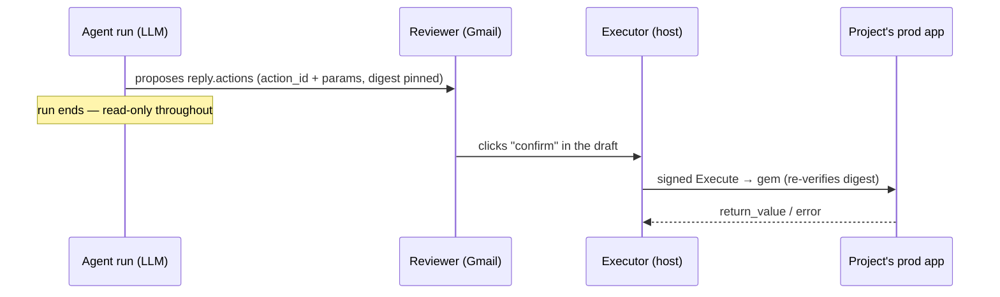
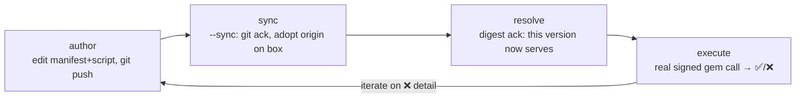

# Actions — the one state-changing plane

Everything else in a brain is **read-only diagnosis**: grounding scripts read a customer's data, the
agent drafts a reply, nothing in the customer's world changes. An **action** is the single deliberate
exception — the one path by which a run can *do* something to a project's app instead of just
describing it.

> ⚠️ **In PROD the WRITE BODY executes on the project's OWN production app/infra — never as a prod dry
> run.** For a **gem** action the body is Ruby running in the customer's app: the only way to exercise
> it is for real against whatever `action_runner_url` points at — iterate against a **staging** gem or
> write strictly **idempotent** actions. For a **hosted Python** action (`script.py`) you additionally
> get a **faithful LOCAL dry-run**: `brain_action.py` (below) runs the real body the way
> `HostedExecutor` does — same `RC_ACTION_PARAMS`/`RC_ACTION_RESULT` contract, fed **only** the sealed
> `.env.action`, defaulting `RC_ACTION_DRY_RUN=1` so the transaction **rolls back**. That is a laptop
> reproduction, not the prod path; prod itself still has no dry run.
>
> What you can *also* check locally and in-loop, read-only, is whether the **inputs make sense** — the
> [validation layers](#validating-inputs-layer-1--preflight) (a manifest schema + an optional
> read-only `preflight.py`) catch a mis-grounded param before a human ever confirms.

## Testing a hosted Python action locally (`brain_action.py`)

A **hosted** Python action (`actions/<id>/{manifest.yaml, script.py, preflight.py?}`, runtime `python`)
runs locally through the brain-dev kit's `brain_action.py`, which mirrors `HostedExecutor` and gives the
same feedback at the same points — **dry-run by default** (the body rolls back):

```bash
SKILL=<brain-dev skill dir>
uv run "$SKILL/scripts/brain_action.py" --list
uv run "$SKILL/scripts/brain_action.py" <id> --params '<json>' --preflight-only   # Layer-1 + preflight
uv run "$SKILL/scripts/brain_action.py" <id> --params '<json>'                    # + body, DRY-RUN (rollback)
uv run "$SKILL/scripts/brain_action.py" <id> --params '<json>' --commit           # REAL write (safe target only)
```

It reproduces prod precisely: **(1)** Layer-1 manifest validation (the same `type`/`format`/`pattern`/
`enum`/`required` the host runs at propose time); **(2)** the `preflight.py` read-only against the
grounding `.env`; **(3)** the write body against the sealed **`.env.action` ONLY** — so the action
container's env isolation is faithful, and a read DSN the body needs but that's missing from
`.env.action` fails locally exactly as it would in prod. It is **not** the prod path: authoring against
a real run still goes push → `/rc-sync-brain` → `/rc-action-test`. `--commit` writes for real — point
`.env.action` at a local/staging DB, never a live customer. The worked example is momentum-tools'
`boost_powertools_credits` (its `PLAYBOOK.md` + `actions/README.md`).

## What an action is

A vetted, parameterized, **digest-pinned** script in the operator-governed registry:

```
brain/actions/<id>/
  manifest.yaml      # id, description (the agent reads this to decide), params schema, mode
  script.rb          # the body that runs inside the customer app (Ruby, via the gem)
```

- **Vetted & operator-governed** — it lives in the brain repo, reviewed and merged like any other
  brain change. The agent can't invent one at run time; it can only reach for one that already exists.
- **Parameterized** — the agent supplies `params` (e.g. `{"invoice_id":"in_123"}`); the script is a
  template, not a one-off.
- **Digest-pinned** — the approved version is identified by `sha256(script.rb)`. A proposal pins the
  digest *at propose time* and the executor refuses to run a stale one, so "what was approved" and
  "what ran" provably match. (This is why editing the script means re-proposing — see the loop below.)

It is **not** a `from lib import db` grounding script: it's Ruby, it runs inside the customer's app,
and `brain-dev`'s `uv`/`docker` runners don't apply to it.

## Propose → confirm → execute (the product flow)

The agent **never executes**. The separation is the whole safety model:



The agent only ever populates `reply.actions` with a *proposal*. A human clicks **confirm** in the
Gmail draft; only then does execution happen — **post-loop, in a context distinct from the LLM run**.
A run that proposes nothing changes nothing.

## Two execution modes (per project)

| Mode | Where the script runs | Status |
|---|---|---|
| **gem** | The customer hosts the `rootcause-action-gem`; the host sends it a signed Execute call and it runs the script inside their app. | shipped |
| **rootcause-hosted** | We run the action against the project's app from our own infra. | planned |

The plane is **off by default** and requires four-sided wiring — see
[`ship-and-verify.md` → "Precondition"](../skills/brain-dev/ship-and-verify.md) for the full
checklist (box `ACTION_TOKEN_KEY`, per-project row, customer-app RackApp mount + `ROOTCAUSE_FETCH_URL`,
brain sync). Use `scripts/rc_action_enable.sh <project> --runner-url <url>` to set the per-project
side and print the rest of the checklist.

## Ground first — verify against real runs before you author

**Don't author an action blind.** Before you write or change `actions/<id>/`, inspect what the agent
*actually did* on real cases with the project's own [`rc` CLI](rc-cli.md): `rc runs --limit 20`
(filter `--kind`/`--category`) to find relevant runs, then `rc run <id> --events` to read the
per-event trace — each tool call's bash command + stdout/stderr. That evidence shapes the action's `params` schema and its
`description` (what makes a future run reach for it). This is the standard "verify against real data
first" step — see the full [author→verify loop](rc-cli.md#the-author--verify-loop--ground-in-real-runs-before-you-write-an-action).

## Validating inputs (Layer 1 + preflight)

The agent fills `params` from a thread, so it can **mis-ground** them — an org *name* where a slug is
wanted, the wrong model, a stale uuid. Two **read-only, in-loop** layers catch that *before* the
proposal reaches the human, so the agent self-corrects instead of a person discovering it on a failed
confirm. Neither is a dry run of the write body (that's intrinsically mode-specific and can't run in our
container) — they check *preconditions observable in the data*.

- **Layer 1 — manifest, always, no script.** A `Param` carries optional `format` (`email|url|uuid`),
  `pattern` (anchored regex), and `enum` (closed set); the host validates them at propose time. Cheap
  *shape* checks — a non-uuid id, a name-shaped slug, an out-of-set value — with zero DB access.
- **Layer 2 — `preflight.py`, optional, read-only.** When `actions/<id>/preflight.py` exists, it runs
  in our grounding container at propose time and predicts *would these args do the intended thing* using
  real data (e.g. "no Subscription <uuid> for tenant 'lbv'"). It reads `$PREFLIGHT_PARAMS`, writes a
  `PreflightResult` `{ok, summary, reason?, observed?}` to `$PREFLIGHT_RESULT`. **Fail-closed:**
  `ok:false`/crash/unparseable ⇒ the proposal is blocked and `reason` returns to the model; `ok:true` ⇒
  `summary`/`observed` ride the draft + confirm button. The catalog flags it `(preflight)`.

> **Test the preflight locally.** A preflight is a read-only grounding-plane script, so the standard
> [`brain-dev`](skills/brain-dev/SKILL.md) runner executes it on the laptop —
> `brain_run.py actions/<id>/preflight.py --params '<json>'` (write a thin `--params`/stdout fallback
> alongside the prod `$PREFLIGHT_PARAMS`/`$PREFLIGHT_RESULT` env contract so the *same* file runs both
> ways). The kampadmin `recompute_record_formulas` action is the worked example — see its
> `PLAYBOOK.md` + `tools/preflight.sh` wrapper.

> **Honest caveat:** a preflight for a *gem* action re-encodes the Ruby body's logic in Python and can
> **drift**. Lean on checks that are genuinely data-observable (does the tenant/record exist) and let
> them **fail closed** when a derived mapping is uncertain; the write body's own guards stay the hard
> gate. Don't write a preflight that merely duplicates a fragile slice of the body.

## Local verify — gem vs hosted

| What you can do locally | gem | hosted Python |
|---|---|---|
| Layer-1 manifest syntax (`ruby -c`) | ✅ | n/a |
| Layer-1 + preflight via `tools/preflight.sh` or `brain_run.py` | ✅ (preflight is Python) | ✅ |
| Full body, dry-run (rollback) | ❌ no local Ruby runtime for gem | ✅ `brain_action.py` (see below) |
| Whole-pipe validate, zero side effects | ✅ `rc_action_doctor.sh` | ✅ `rc_action_doctor.sh` |

> ⚠️ **Gem rspec ≠ wire contract proof.** `bundle exec rspec -q` on the gem runs against mocks.
> Contract bugs (schema shape, `project_id` on fetch, signed-response format) are invisible to mocked
> tests. The wire contract between the host and the gem is specified in **`WIRE-CONTRACT.md`** (in
> the `rootcause` repo) — concrete tests in both repos guard it. A green gem rspec does NOT
> prove the host↔gem pipe works. The side-effect-free pre-flight is:
> `scripts/rc_action_doctor.sh <project> <action_id> [--params '<json>']` — runs a `dry_run`
> validate-only invocation, returns `would_execute:true` or a **named** structured error
> (`error.class` + `error.message`, e.g. `resolve_failed`, `schema_violation`). Run it before
> committing to a real execute.

## The author → test loop

This is the spine of authoring an action. The mechanics of the trigger live in **rootcause** —
this page teaches the loop; the command is
[`/rc-action-test`](../../rootcause/.agents/commands/rc-action-test.md) (script
`scripts/rc_action_test.sh <project> <action_id> [--params '<json>'] [--sync]`).



1. **Author** — edit `brain/actions/<id>/{manifest.yaml,script.rb}` in the brain repo and
   `git push origin main`. (The brain is push-only; if rejected, `git pull --rebase` first.)
2. **Sync (git ack)** — `--sync` adopts `origin/main` onto the box (`/rc-sync-brain` under the hood)
   so a *just-pushed* version becomes the approved one. It **refuses while a run is in flight** and
   bails on a true divergence — that's the no-conflict gate.
3. **Resolve (digest ack)** — confirms the new version is now serving, read from the same box-local
   brain `main` the executor serves from, so ack and execution can't disagree. A 404 here means the
   action isn't approved on the box yet (author + push, then re-run with `--sync`).
4. **Execute** — the real signed gem call. On ❌, the host surfaces the gem's **structured error**:
   `error.class` (e.g. `resolve_failed`, `schema_violation`) + `error.message` — so a failure names
   its cause. Fix `script.rb` and loop. Before a real execute, consider `rc_action_doctor.sh` for a
   zero-side-effect dry-run validate pass (see above).

`/rc-action-test` is the **operator dev-trigger**: it fires the *exact same* signed Execute path the
Gmail **confirm** button fires (same digest re-verify, same signing, same `egress_log`) — it just
mints the `action_run` by name (`run_id=NULL`, `approved_by="operator:dev"`) and skips the email
round-trip. It re-pins the current digest on every call, so the re-propose dance never bites during
authoring.

> **No dry run of the WRITE — say it again.** `/rc-action-test` and the Gmail confirm both **execute
> the body for real**. There is no local or simulated *write* path — only the read-only
> [preflight](#validating-inputs-layer-1--preflight) predicts preconditions in-loop. Default to a
> staging target or idempotent actions.

## Related

- [`rc` CLI](rc-cli.md) — the project's self-service window into its own runs; the **ground-first**
  step (`rc runs`, `rc run <id> --events`) that should precede authoring any action. `rc ask "<symptom>"
  --brain-ref dev/x` + [`brain_dump.py`](../skills/brain-dev/SKILL.md#test-a-brain-change-on-real-prod-infra--without-pushing-main-rc-ask--brain_dumppy)
  is now the project-dev's **Mode A** ("did the agent reach for the action?") — real prod infra, action
  flagged `test`, **no operator/SSM access and no `main` push** required.
- [`/rc-action-test`](../../rootcause/.agents/commands/rc-action-test.md) — the trigger command
  (arguments, what it relays, how it works).
- [rootcause `action-runbook.md`](../../rootcause/.agents/skills/support/action-runbook.md)
  — enabling the plane, the full Execute mechanics, the reviewer-confirm path.
- [`ship-and-verify.md`](../skills/brain-dev/ship-and-verify.md) — the broader outer loop (push → sync
  → feedback), including the *agent-propose* feedback mode (does the agent reach for the action?) vs
  the *execution* feedback mode (does the script work?).
- [`brain-dev` SKILL](../skills/brain-dev/SKILL.md) — the read-only, runs-locally counterpart.
