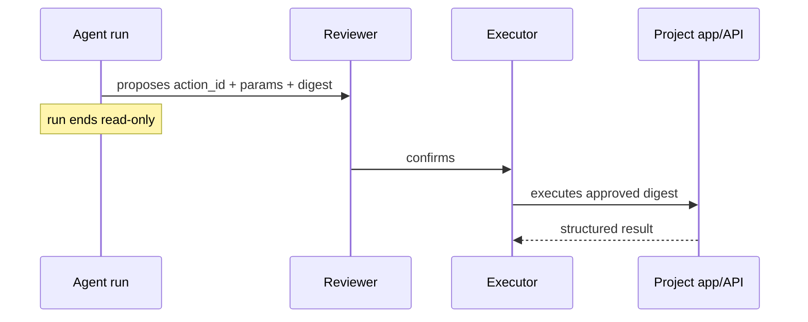

# Actions

Everything else in a brain is read-only diagnosis. An action is the deliberate state-changing plane:
the run proposes vetted params, a human confirms later, and only then does the executor run the
approved digest.

Read [docs/side-effects.md](side-effects.md) before reporting action results.

## Product Flow



A draft that says "booked", "cancelled", or "refunded" is not proof of mutation. Check the action
lifecycle: preflight blocked, proposed and pending, confirmed/executed, or failed.

## Brain Layout

```text
actions/<id>/
  manifest.yaml
  script.rb | script.py
  preflight.py
  policy.py
```

- `manifest.yaml` describes the action, param schema, any hosted write connections, and its `autonomy`.
- `preflight.py`, when present, is read-only and blocks unsafe/mis-grounded params before proposal.
- `policy.py`, when present, is read-only and decides per-invocation whether an `autonomy: policy` action
  auto-executes or escalates to a human (see [Autonomy](#autonomy-human--policy--auto)).
- `script.rb` is customer-hosted Embassy mode.
- `script.py` is hosted Python mode and should use `lib.action`.

Prefer single-purpose, reviewer-legible actions with one concrete business outcome. Split multi-system
workflows unless the combined operation is atomic and idempotent.

Action docs/runbooks should put exact safety guards and verification checks near the top: required
evidence, disqualifying states, preflight expectations, post-execution proof, and when to refuse or
escalate.

## Param Types

`manifest.yaml` params are a small closed vocabulary:

- `string` (default), `integer`, `number`, `boolean`, `string[]`, `object` for JSON values.
- `attachment` for a user-provided email/dashboard file. The agent proposes an attachment id; hosted
  execution rewrites it to a file descriptor, consumed with `p.file("<name>")`.
- `generated_file` for a host-rendered artifact. The manifest must name a `generator`; currently
  `email_message_pdf` renders an email message to PDF from
  `{"kind":"email_message_pdf","message_id":"<local_message_id>"}`. Before `script.py` starts, the host
  rewrites it to the same file descriptor shape consumed with `p.file("<name>")`. Generated-file params
  are hosted-only and cannot have `preflight.py`.

Use `format`, `pattern`, and `enum` on scalar params; use `accept` as a MIME allowlist for file params.

## Autonomy (`human` | `policy` | `auto`)

By default an action is **human-gated**: the run proposes, a reviewer confirms, and only then does the
executor run — the flow the diagram above shows. A manifest may raise its **autonomy** so eligible actions
execute **mid-loop** (inside the run, via the agent's `action` tool) — the agent then sees the real
`{ok, summary}` and writes a **factual** draft from it, instead of the optimistic "as-if-done" draft used
for human-gated proposals.

```yaml
# actions/<id>/manifest.yaml
autonomy: human   # default (omit = human)
# autonomy: policy   # a per-invocation policy.py decides allow → auto-execute, deny → escalate to human
# autonomy: auto     # always auto-execute — reserve for idempotent / low-blast-radius actions
```

**You only DECLARE autonomy; the host GATES it.** The effective autonomy is
`min(manifest, project cap)`, then clamped to `human` by any of these floors — so a raised manifest never
means "always auto":

- `projects.action_autonomy_max` — an operator-set ceiling (`human` by default). It can only lower, never
  raise. Read it with `rc --project <p> action config get -o json` (field `action_autonomy_max`); an
  operator raises it in the console Action settings. Until the operator raises it, every action stays
  `human` no matter what the manifest says.
- `risk: high` in the manifest → always `human` (risk is now **load-bearing**, not just informational).
- **brain-TEST runs** (a `--brain-ref` dev run) → always `human`, so testing a new `auto` action never
  fires a real write.
- **Plane**: mid-loop is **email + analysis only**. MCP / Prompt-API / chat runs always resolve to `human`.
- **Mode**: **hosted (`script.py`) only** in v1. Embassy (`script.rb`) actions stay `human` whatever the
  manifest says — keep their manifests `autonomy: human`.

The catalog the agent sees labels each action with its **effective** autonomy (`(auto)`, `(policy-gated)`,
or nothing for human) — so the agent is never told it can auto-run something the cap or a floor forbids.

### `policy.py` — the per-invocation gate

`autonomy: policy` **requires** a `policy.py` (the host refuses to resolve the action without one). It is
**orthogonal to preflight**: preflight answers *"will these params do the intended thing?"* (advisory,
agent-visible, runs in the live run container); policy answers *"is a human needed for THIS invocation?"*
(authorization). An action may have either, both, or neither.

Because the verdict **replaces a human**, policy runs **host-side** in a fresh one-shot **read-only
grounding container** (the grounding `.env` read DSNs, brain `:ro`, no write plane, no agent) — a run
cannot forge it. Contract, mirroring preflight:

- params in via `$RC_POLICY_PARAMS` (JSON), verdict out to `$RC_POLICY_RESULT`:
  `{"allow": bool, "reason": "human-readable", "observed": {...}?}`.
- `reason` rides back to the agent and onto the human-confirm button on a deny, so write it for the reviewer.
- **Fail-closed to escalate, NEVER allow**: a crash, timeout, non-zero exit, unparseable result, or a
  missing `allow` key all resolve to `deny` → the action escalates to the ordinary human-confirm proposal.
  A `deny` is never a hard refusal — the capability still runs, just with a human in the loop.

```python
#!/usr/bin/env python3
# actions/refund_order/policy.py — auto-refund small orders, escalate the rest.
import json, os
from lib import db  # grounding read plane (RC_TENANT_ID/RC_TENANT_SLUG also available when tenant-bound)

p = json.load(open(os.environ["RC_POLICY_PARAMS"]))
order = db.query_one("select total_cents, status from orders where id = %s", [p["order_id"]])

allow = bool(order) and order["status"] == "paid" and order["total_cents"] <= 5000
reason = "order ≤ €50 and paid — safe to auto-refund" if allow else "over the €50 auto-refund cap or not in a refundable state — needs a human"

json.dump({"allow": allow, "reason": reason, "observed": {"total_cents": order and order["total_cents"]}},
          open(os.environ["RC_POLICY_RESULT"], "w"))
```

**Determinism is burned at approval.** `policy.py` is part of the action's composite **approval digest**
(manifest + script + policy + preflight), so once an action version is approved the rule that gates its
autonomy cannot silently drift. Put project-specific thresholds (refund caps, allowed settings) **in the
script or in files in this brain** — brains are per-project, so this stays data-not-code with no host
branching. `approved_by` on the settled row records exactly which rule authorized a write
(`policy:<approval_digest>` or `autonomy:auto`).

### Best practices

- **Default to `human`.** Raise autonomy only for an action whose blast radius you would sign off on
  unsupervised, with params a burned rule already vets.
- **`auto` only for idempotent / low-blast-radius** actions (resend a receipt, regenerate a token,
  re-enqueue a mailer) — something a retry or a wrong-but-valid param can't make dangerous. The mid-loop
  path dedups real River retries by `(run_id, action_id, sha256(params))`, but design the write to be
  safely repeatable anyway.
- **Prefer `policy` over `auto`** whenever a data-observable precondition separates the safe cases from the
  ones that need a human (an amount cap, a state check, a whitelist). Keep the policy tight and readable —
  a reviewer approves it at the library gate.
- **Scope tenant writes by the trusted identity.** On a tenant-enabled project the policy (and the body)
  must read `RC_TENANT_ID` / `RC_TENANT_SLUG` and treat `params` as the untrusted in-tenant target only —
  never let params choose the tenant.
- **Write the draft factually for executed actions.** When an action auto-executes, the run already has the
  real result — an `ok:false` outcome means adapt the draft or escalate, not claim success.

## Inspect Access

Before depending on a connector or write plane, check the project from the same login/profile that will
run the action:

```bash
rc --project <project> connection ls -o json
rc --project <project> capabilities -o json
rc --project <project> action list -o json
rc --project <project> action config get -o json
```

`connection ls` shows connected OAuth/API grants. `capabilities` shows console planes such as
`planes.action`. `action list` shows the hosted/cataloged actions visible to this login. `action config
get` shows whether action execution is enabled and wired. For read-plane confidence, smoke-test the
read connector through `rc bash run 'python -m lib.api get ...'` or the provider's `lib.connectors.*`
module.

## Hosted Python Harness

Hosted Python actions import the baked runtime harness instead of hand-rolling params, result files,
credential lookup, HTTP retries, and error envelopes. This minimal example shows the harness shape; add
an action-specific idempotency/reuse guard before using a write helper in production.

```python
#!/usr/bin/env python3
from lib import action
from lib.action import googledrive

p = action.params()
f = p.file("attachment")

uploaded = googledrive.upload_file(folder_id=p["folder_id"], file=f)

action.ok(
    f"Saved **{f.filename}** to Drive.",
    {"drive_file_id": uploaded.id, "drive_web_url": uploaded.web_url},
)
```

`action.params()` reads `$RC_ACTION_PARAMS` and installs crash capture. `p["name"]` is required;
`p.get("name")` is optional. `p.file("attachment")` returns a `FileParam` with `path`, `filename`,
`mime_type`, `size_bytes`, `attachment_id`, `sha256` when provided, plus `open()` and `read_bytes()`.

`action.ok(summary, data)` writes the success Result to `$RC_ACTION_RESULT`, prints it, and exits.
`action.fail(summary, data)` is a handled negative: the executor worked, but the reviewer should not
send the optimistic draft. `raise action.ActionError("message")` is a hard handled failure without a
Python backtrace. Any other uncaught exception is captured with a backtrace in the Result file.

Function style is also supported:

```python
from lib import action

@action.main
def run(p):
    return {"summary": "Done.", "id": p["id"]}
```

## Write Connections

Hosted OAuth/API writes go through `lib.action.client("<capability>")` or provider helpers under
`lib.action.*`. For brokered write connections, action code should not read env vars directly.

```yaml
connections:
  - airtable.write
  - googledrive.write
  - notion.write
```

`action.client("airtable.write")` resolves only `RC_ACTION_AIRTABLE`, never `RC_CONN_AIRTABLE`;
`action.client("notion.write")` resolves only `RC_ACTION_NOTION`, never `RC_CONN_NOTION`. Both return
a `lib.api.Client` with write verbs enabled. Missing credentials fail closed with guidance to declare
the capability and connect a write grant (`label=actions`). Read connectors under `lib.connectors.*`
remain read-only and `RC_CONN_*`-backed.

Available provider helpers are intentionally small and grown as actions need them. When adding or
changing a provider helper, update that provider module's literal `ACTION_HELPER_DOCS` constant in
`runtime/lib/action/<provider>.py`. The dashboard authoring overlay in the rootcause host repo loads
those constants from the pinned `rootcause-runtime` tag, parses them with Python AST without importing
the modules, derives helper signatures from real top-level functions, and renders
`dashboard-overlay/action-integrations*.generated.md`. That constant is model-facing downstream, so keep
it as the explicit write-plane whitelist inside `lib.action.*`, not under `lib.connectors.*`; connector
manifests and private underscored connector functions stay read-plane and are not action-authoring docs
unless deliberately promoted as public action helpers.

One-off write calls can use the generic client:

```python
from lib import action

c = action.client("linear.write")
c.post("issues", json={"title": "Customer follow-up"}, idempotency_key="issue-123")
```

Write requests are not retried blindly. Passing `idempotency_key=` sets the `Idempotency-Key` header
and opts that request into transient-status retry.

## Local Hosted-Python Checks

```bash
SKILL=<local-brain-work skill dir>
uv run "$SKILL/scripts/brain_action.py" --list
uv run "$SKILL/scripts/brain_action.py" <id> --params '<json>' --preflight-only
uv run "$SKILL/scripts/brain_action.py" <id> --params '<json>' --policy-only   # Layer-1 + preflight + the autonomy verdict
uv run "$SKILL/scripts/brain_action.py" <id> --params '<json>'
uv run "$SKILL/scripts/brain_action.py" <id> --params '<json>' --commit
```

The runner reproduces the prod ordering — Layer-1 → preflight → **policy gate** → write body. `--policy-only`
runs `policy.py` read-only in the grounding env and prints whether this invocation would **auto-execute**
(allow) or **escalate to a human** (deny), with the exit code reflecting the verdict — the way to iterate on
an `autonomy: policy` rule before publishing. Default body execution is a local dry-run rollback. `--commit`
writes for real to whatever `.env.action` targets; use only safe local/staging targets unless explicitly
intending a real write. Inside scripts, `action.dry_run()` follows `--commit` > `--dry-run` >
`RC_ACTION_DRY_RUN=1`.

For `generated_file`, local Layer-1 accepts the hosted source object shape, but the local runner cannot
render it. Body tests need a materialized descriptor with a local `path`.

For tenant-enabled projects, use `action.require_tenant()` and scope every write by the trusted
`RC_TENANT_ID` / `RC_TENANT_SLUG` values, never by model-proposed params.

## Embassy Ruby Checks

Embassy actions (`runtime: ruby`, `script.rb`) execute inside the customer's app, so the local brain kit
cannot faithfully dry-run the write body. Keep the feedback loop split by fidelity:

```bash
# manifest + preflight, read-only, from the brain checkout
uv run "$SKILL/scripts/brain_action.py" <id> --params '<json>' --preflight-only

# Ruby body syntax, mirroring the Embassy executor's lambda wrapper
{ printf 'lambda do |params|\n'; cat actions/<id>/script.rb; printf '\nend\n'; } | ruby -c -

# real signed path, after pushing/syncing a safe target
rc action run <id> --params '<json>' --sync
```

For `runtime: ruby`, local body execution is not a substitute for the Embassy path: Rails constants,
tenant middleware, callbacks, PaperTrail, Sidekiq, and service credentials all live in the app. Use
preflight for data-observable checks (row exists, current state, shape/diff), Ruby syntax for cheap parse
errors, and the signed dev-trigger for final confirmation on a safe idempotent or staging target.

Review checklist for Embassy Ruby bodies:

- Resolve every model/class/job choice through an in-script allowlist or app-owned registry lookup; never
  `constantize` user input.
- Re-check all params in Ruby even when manifest and preflight already passed.
- For cross-tenant staff actions that must accept `tenant_id`, resolve `Tenant.find_by(id:)`, refuse the
  default tenant for settings/record writes, and wrap the body in `ActsAsTenant.with_tenant`.
- Put batch work behind an app job and return the job id; the Embassy request itself should stay bounded.
- Return a reviewer-readable `{ok, summary, ...}` with read-back proof and any rollback handle, not just
  "done".

## Ground First

Do not author an action blind:

1. Find relevant real runs with `rc runs`, `rc fleet`, or `rc patterns`.
2. Inspect what the agent actually did with `rc run <id> --events` or `rc-debug`.
3. Shape `description`, params, and preflight from evidence.
4. Verify with local checks.
5. Push a dev branch and run `rc ask --brain-ref dev/<branch>` to see whether the agent proposes the
   action with sane params.
6. Use `brain-publish` for live publish/promote/support handoff.
7. For an explicit production action, use `prod-console` / `rc action preflight` / `rc action run`
   after params are grounded.

Do not document private RootCause commands here. Use public `rc` surfaces; if a publish/support step is
missing, route through `brain-publish`.

## Triage

Use [`skills/local-brain-work/action-run-triage.md`](../skills/local-brain-work/action-run-triage.md)
when a run mentions an action, a preflight, or apparent mutation.
