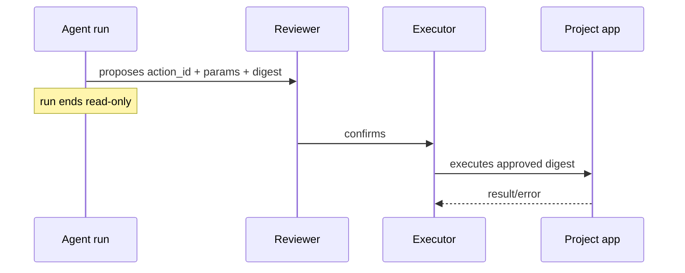

# Actions

Everything else in a brain is read-only diagnosis. An action is the deliberate state-changing plane:
the run may propose a vetted action, but execution is gated outside the LLM loop.

Read [docs/side-effects.md](side-effects.md) before reporting action results.

## Product Flow



A draft that says "booked", "cancelled", or "refunded" is not proof of mutation. Check the action
lifecycle: preflight blocked, proposed and pending, confirmed/executed, or failed.

## Brain Layout

```text
actions/<id>/
  manifest.yaml
  script.rb | script.py
  preflight.py
```

- `manifest.yaml` describes the action and parameter schema the model sees.
- `preflight.py`, when present, is read-only and can block unsafe/mis-grounded params before proposal.
- `script.rb` is customer-hosted Embassy mode.
- `script.py` is hosted Python mode and can be dry-run locally with `brain_action.py`.

## Local Hosted-Python Checks

```bash
SKILL=<local-brain-work skill dir>
uv run "$SKILL/scripts/brain_action.py" --list
uv run "$SKILL/scripts/brain_action.py" <id> --params '<json>' --preflight-only
uv run "$SKILL/scripts/brain_action.py" <id> --params '<json>'
uv run "$SKILL/scripts/brain_action.py" <id> --params '<json>' --commit
```

Default body execution is a local dry-run rollback. `--commit` writes for real to whatever
`.env.action` targets; use only safe local/staging targets unless explicitly intending a real write.

## Ground First

Do not author an action blind:

1. Find relevant real runs with `rc runs`, `rc fleet`, or `rc patterns`.
2. Inspect what the agent actually did with `rc run <id> --events` or `rc-debug`.
3. Shape `description`, params, and preflight from evidence.
4. Verify with local checks.
5. Push a dev branch and run `rc ask --brain-ref dev/<branch>` to see whether the agent proposes the
   action with sane params.
6. Use `brain-publish` for live publish/promote/support handoff.

Public `rc` does not currently expose every action publish/execute trigger. Do not document private
RootCause commands here; use `brain-publish` to prepare the support request when needed.

## Triage

Use [`skills/local-brain-work/action-run-triage.md`](../skills/local-brain-work/action-run-triage.md) when a run
mentions an action, a preflight, or apparent mutation.
