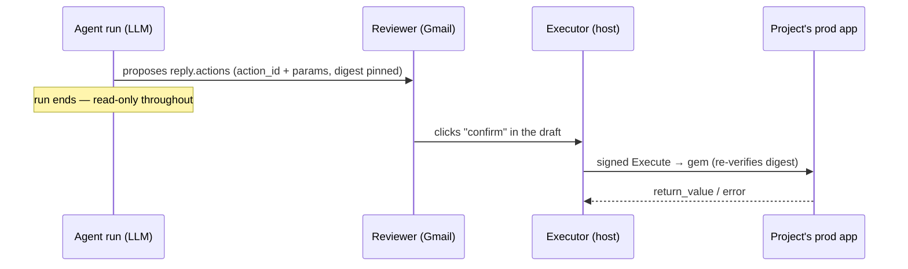
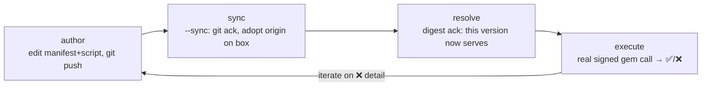

# Actions — the one state-changing plane

Everything else in a brain is **read-only diagnosis**: grounding scripts read a customer's data, the
agent drafts a reply, nothing in the customer's world changes. An **action** is the single deliberate
exception — the one path by which a run can *do* something to a project's app instead of just
describing it.

> ⚠️ **Actions execute on the project's OWN production app — not the laptop.** Unlike `brain-dev`
> (which reproduces read-only diagnosis locally), there is **no local action run and no dry run**. The
> only way to exercise an action is to run it for real against whatever `action_runner_url` points at.
> Iterate against a **staging** gem, or write strictly **idempotent** actions, before firing one at a
> live customer.

## What an action is

A vetted, parameterized, **digest-pinned** script in the operator-governed registry:

```
brain/actions/<id>/
  manifest.yaml      # id, description (the agent reads this to decide), params schema, mode
  script.rb          # the body that runs inside the customer app (Ruby, via the gem)
```

- **Vetted & operator-governed** — it lives in the brain repo, reviewed and merged like any other
  brain change. The agent can't invent one at run time; it can only reach for one that already exists.
- **Parameterized** — the agent supplies `params` (e.g. `{"invoice_id":"in_123"}`); the script is a
  template, not a one-off.
- **Digest-pinned** — the approved version is identified by `sha256(script.rb)`. A proposal pins the
  digest *at propose time* and the executor refuses to run a stale one, so "what was approved" and
  "what ran" provably match. (This is why editing the script means re-proposing — see the loop below.)

It is **not** a `from lib import db` grounding script: it's Ruby, it runs inside the customer's app,
and `brain-dev`'s `uv`/`docker` runners don't apply to it.

## Propose → confirm → execute (the product flow)

The agent **never executes**. The separation is the whole safety model:



The agent only ever populates `reply.actions` with a *proposal*. A human clicks **confirm** in the
Gmail draft; only then does execution happen — **post-loop, in a context distinct from the LLM run**.
A run that proposes nothing changes nothing.

## Two execution modes (per project)

| Mode | Where the script runs | Status |
|---|---|---|
| **gem** | The customer hosts the `rootcause-action-gem`; the host sends it a signed Execute call and it runs the script inside their app. | shipped |
| **rootcause-hosted** | We run the action against the project's app from our own infra. | planned |

The plane is **off by default** and enabled per project (`actions_enabled` + an `action_runner_url` +
a reverse secret + the gem host on the egress allowlist).

## Ground first — verify against real runs before you author

**Don't author an action blind.** Before you write or change `actions/<id>/`, inspect what the agent
*actually did* on real cases with the project's own [`rc` CLI](rc-cli.md): `rc runs --limit 20`
(filter `--kind`/`--category`) to find relevant runs, then `rc run <id> --events` to read the
per-event trace — each tool call's bash command + stdout/stderr. That evidence shapes the action's `params` schema and its
`description` (what makes a future run reach for it). This is the standard "verify against real data
first" step — see the full [author→verify loop](rc-cli.md#the-author--verify-loop--ground-in-real-runs-before-you-write-an-action).

## The author → test loop

This is the spine of authoring an action. The mechanics of the trigger live in **rootcause-light** —
this page teaches the loop; the command is
[`/rc-action-test`](../../rootcause-light/.agents/commands/rc-action-test.md) (script
`scripts/rc_action_test.sh <project> <action_id> [--params '<json>'] [--sync]`).



1. **Author** — edit `brain/actions/<id>/{manifest.yaml,script.rb}` in the brain repo and
   `git push origin main`. (The brain is push-only; if rejected, `git pull --rebase` first.)
2. **Sync (git ack)** — `--sync` adopts `origin/main` onto the box (`/rc-sync-brain` under the hood)
   so a *just-pushed* version becomes the approved one. It **refuses while a run is in flight** and
   bails on a true divergence — that's the no-conflict gate.
3. **Resolve (digest ack)** — confirms the new version is now serving, read from the same box-local
   brain `main` the executor serves from, so ack and execution can't disagree. A 404 here means the
   action isn't approved on the box yet (author + push, then re-run with `--sync`).
4. **Execute** — the real signed gem call. On ❌, surface `error.class` / `error.message` /
   `backtrace`, fix `script.rb`, and loop.

`/rc-action-test` is the **operator dev-trigger**: it fires the *exact same* signed Execute path the
Gmail **confirm** button fires (same digest re-verify, same signing, same `egress_log`) — it just
mints the `action_run` by name (`run_id=NULL`, `approved_by="operator:dev"`) and skips the email
round-trip. It re-pins the current digest on every call, so the re-propose dance never bites during
authoring.

> **No dry run — say it again.** `/rc-action-test` and the Gmail confirm both **execute for real**.
> There is no local or simulated action path. Default to a staging target or idempotent actions.

## Related

- [`rc` CLI](rc-cli.md) — the project's self-service window into its own runs; the **ground-first**
  step (`rc runs`, `rc run <id> --events`) that should precede authoring any action.
- [`/rc-action-test`](../../rootcause-light/.agents/commands/rc-action-test.md) — the trigger command
  (arguments, what it relays, how it works).
- [rootcause-light `action-runbook.md`](../../rootcause-light/.agents/skills/support/action-runbook.md)
  — enabling the plane, the full Execute mechanics, the reviewer-confirm path.
- [`ship-and-verify.md`](../skills/brain-dev/ship-and-verify.md) — the broader outer loop (push → sync
  → feedback), including the *agent-propose* feedback mode (does the agent reach for the action?) vs
  the *execution* feedback mode (does the script work?).
- [`brain-dev` SKILL](../skills/brain-dev/SKILL.md) — the read-only, runs-locally counterpart.
