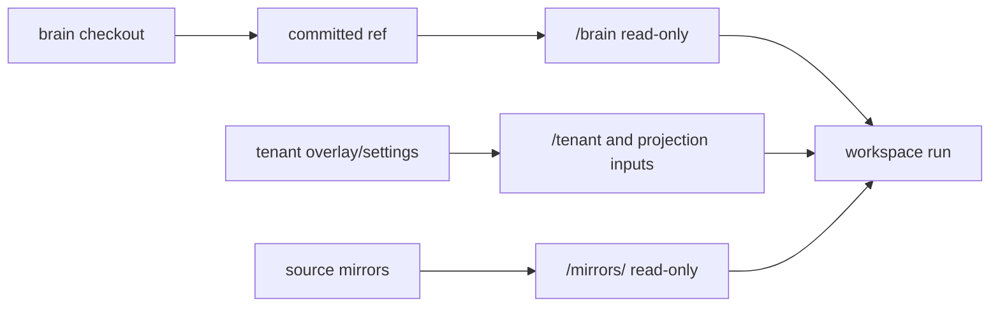

# Brain Model

A brain checkout is the project-owned knowledge and tooling tree RootCause mounts read-only for a run.
It is external-developer facing: no private RootCause source, host credentials, or infrastructure shell
is required to work on it.

## Layout

| Path | Purpose |
|---|---|
| `.rootcause.toml` | Committed non-secret binding: project slug, base URL, and sometimes tenant metadata. `rc` uses this to scope commands. |
| `.env` | Gitignored grounding secrets for local `brain-dev` live checks. Pull with `rc env pull`. |
| `.env.action` | Gitignored sealed write credentials for local hosted-Python action tests. Only `brain_action.py` uses it. |
| `AGENTS.md` | Local instructions for agents working in that brain repo. |
| `skills/` / `playbooks/` / notes | Durable knowledge and project-specific scripts a run may read. |
| `skills/*/scripts/*.py` | Grounding scripts; import `from lib import db/fs/http/...` from `rootcause-runtime`. |
| `tests/`, fixtures | Brain-local test fixtures; safe to commit when project-specific. |
| `actions/<id>/` | Optional action catalog: manifest plus script/preflight. Proposal is in-loop; execution is gated later. |
| `.rootcause/` | Gitignored local artifacts: debug dumps, projection previews, run dumps. Never commit. |

## Production Mounts

Only committed files travel to `/brain`. Untracked or gitignored local kit installs, `.env`, dumps, and
test artifacts stay on the laptop.

## Project And Tenant Brains

- A project/shared brain holds shared grounding scripts, playbooks, projection templates, and the
  shared action catalog.
- A tenant brain, when present, holds tenant-specific natural-language overlay. Tenant values may live
  in RootCause settings rather than committed files.
- A templated project brain may compile a tenant-specific `/brain` view from `projection.yaml` plus
  tenant settings. Preview locally with `brain_projection.py` when present.

## Channels And Refs

- Flat projects often read `main` directly.
- Tenant-enabled shared project brains usually read a channel ref such as `stable` or `edge`, recorded
  in run trace as `brain_resolved`.
- `rc ask --brain-ref dev/<branch>` tests a pushed dev ref on production infrastructure without moving
  `main` or promoting a channel.
- Tenant brains typically use their `main` HEAD; shared project brain promotion is separate.

## Local Engine Boundary

`brain-dev` reproduces grounding scripts, test tiers, action preflight/local hosted-Python execution,
and projection previews. It does not run a private copy of the production LLM loop. Use `rc ask` and
`rc run --debug` for full production-loop evidence.
