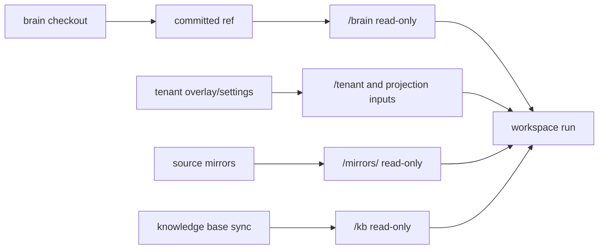

# Brain Model

A brain checkout is the project-owned knowledge and tooling tree RootCause mounts read-only for a run.
It is external-developer facing: no private RootCause source, host credentials, or infrastructure shell
is required to work on it.

## Layout

| Path | Purpose |
|---|---|
| `.rootcause.toml` | Committed non-secret project binding, with optional tenant metadata. `rc` uses it to scope commands; legacy `base_url` values do not steer the current CLI. |
| `.env` | Gitignored grounding secrets for Local Brain Work live checks. Pull with `rc project env pull`. |
| `.env.action` | Gitignored sealed write credentials for local hosted-Python action tests. Only `brain_action.py` uses it. |
| `AGENTS.md` | Local instructions for agents working in that brain repo. |
| `skills/` / `playbooks/` / notes | Durable knowledge and project-specific scripts a run may read. |
| `skills/*/scripts/*.py` | Grounding scripts; import `from lib import db/fs/http/...` from `rootcause-runtime`. |
| `tests/`, fixtures | Brain-local test fixtures; safe to commit when project-specific. |
| `actions/<id>/` | Optional action catalog: manifest plus script/preflight. Proposal is in-loop; execution is gated later. |
| `.rootcause/` | Gitignored local artifacts: debug dumps, projection previews, run dumps. Never commit. |

## Audience And Ownership

This kit is for project developers and their AI agents working from a brain checkout. It should teach
enough production context to let them improve the brain and recognize RootCause support boundaries,
without requiring private RootCause source, host shells, SSM, registry database access, or operator
scripts.

The brain is the project's owned instruction layer. Put business context here: product vocabulary,
support policies, escalation/playbook decisions, grounding scripts, tests, projection templates, and
action manifests. Do not put private RootCause host mechanics, secrets, generic system-prompt rules, or
brand voice/language/signature defaults here; rootcause persona settings own those at project, tenant,
and mailbox scope.

## Brain Versus External Context

At runtime the main loop may receive several read-only sources. They are complementary, not
interchangeable.

| Source | Mounted as | What belongs there | What the brain should say about it |
|---|---|---|---|
| Project brain | `/brain` | Durable business context, terminology, routing, playbooks, scripts, fixtures, projection templates, action catalog. | Which brain files/scripts answer which classes of questions, and how to decide in project terms. |
| Tenant brain/overlay | `/tenant` and/or compiled `/brain` | Tenant-specific labels, local policies, settings-driven substitutions, and domain exceptions. | Shared rules that are safe for all tenants, plus projection templates when the shared brain compiles tenant views. |
| Source mirrors | `/mirrors/<name>` | Customer application code, schemas, config, runbooks, or other source-controlled repositories mirrored by RootCause. | Which repo/file areas explain behaviors; do not copy code facts that should be read from mirrors. |
| Knowledge base | `/kb` | External support docs or synced knowledge sources, when configured. | When to consult KB material and how it should rank against committed brain playbooks. |
| Grounding databases/APIs | `lib.db`, `lib.http`, etc. | Live read-only facts: customers, orders, invoices, app state, remote API data. Runtime-owned HTTP attempts emit the [HTTP audit contract](http-audit.md). | How to query safely, which scripts encapsulate repeated lookups, and what findings mean for the customer. |
| Actions | `actions/<id>/` plus host catalog | Vetted write intents, parameter schemas, read-only preflight, optional hosted execution script. | When an action is the right resolution, required evidence for params, and reviewer-facing caveats. |

If a fact changes with the customer's app state or source code, prefer a grounding script or mirror
lookup over copying it into prose. If a fact is a stable support policy, product concept, customer
promise, or decision tree, put it in the brain with tests where practical.

## Execution Context Boundary

Do not mix the local control plane with the production model's workspace:

| Context | Available interface | Brain access | Instruction home |
|---|---|---|---|
| Local brain-development agent | Public `rc` CLI after OAuth, local engine scripts, local shell | Writable checkout | This kit's locally installed skills and docs |
| Production main LLM loop | `bash` plus the scenario terminal tool (`reply` for email); `/brain` scripts and injected `lib.db`, `lib.cloudwatch`, `lib.http`, `lib.fs`, `lib.connectors`, `lib.api`, `lib.mcp` as configured | `/brain` read-only | Committed project business context, routing, playbooks, and grounding scripts |

There is no `rc` binary in the production loop. Never put `rc ...` command guidance in committed
project-brain content: it cannot execute there and competes with the actual grounding path. A brain
may name required evidence, a `/brain` script, a mirror/KB path, or an injected `lib.*` capability;
local CLI orchestration stays in this kit.

## Author For Navigation

Brains work best when the first useful file routes by the customer's words, then points to concrete
evidence. Keep routing docs short and usually read-only for orientation: they should tell the run what
to open next, but the selected/baked context should normally be the exact runbook, action doc, source
file, KB article, script, or fixture that proves the answer.

For each common area, prefer compact tables over prose. `Check` is what the run should do next;
`Evidence to open` is the concrete file/path/event that should be selected or cited.

| Customer symptom language | Check | Evidence to open | Action / no-action rule |
|---|---|---|---|
| "I was charged twice" / duplicate payment | Run the charge lookup script; search payment logs for duplicate capture events | Billing runbook, `/mirrors/app/.../payments/`, refund KB article, `actions/refund/` guards | Propose refund only when the duplicate-settlement guard passes; otherwise explain pending auth or escalate |
| "I cannot log in" / expired invite or SSO failure | Query user/invite state; search auth logs for invite or SAML errors | Access runbook, `/mirrors/app/.../auth/`, KB article for SSO reset, trace events from the failed run | Send reset steps for normal expiry; escalate tenant SSO config or source bug evidence |
| "The report total looks wrong" / revenue dashboard mismatch | Run the report fixture or query; source-search the metric definition and freshness job | Reporting runbook, `/mirrors/warehouse/.../revenue.sql`, dashboard source, fixture with expected totals | Usually no action: explain freshness/definition, or file a support/source issue with exact evidence |

Useful brain conventions:

- Add a short routing index: symptom phrases -> exact runbook/action/source areas.
- In runbooks, name source mirror paths, source files, log events, DB/helper scripts, and `rg` terms
  where known.
- Maintain a small source map when source mirrors are important: product area -> `/mirrors/<name>/...`
  paths -> useful search terms, classes, jobs, routes, or log events.
- If KB snapshot filenames are opaque, add searchable titles/frontmatter or an index that maps customer
  article titles to `/kb` paths. For traversal examples, see [knowledge-base.md](knowledge-base.md).
- Put customer symptom language beside internal feature names so support emails and source searches
  meet in the same doc.
- For action-backed outcomes, route to the action doc's safety guards and verification checks before
  suggesting proposal.

## Production Prompt Boundary

The production loop also sends standing instructions from RootCause itself, currently in
`rootcause/internal/agent/prompt.go`. Brain docs and shipped skills should stay consistent with that
mindset instead of restating it.

For email runs, `emailPreamble` already tells the model that it is drafting a grounded customer reply
for human review; the draft is customer-facing plain language; technical internals stay out of the
draft; the note is a short plain-language reviewer brief; and actions must not be claimed as done
unless verified by the flow. The shared system prompt already covers the fresh container, read-only
`/brain` and `/mirrors`, writable scratch, grounding mandate, journal path, and terminal-tool finish.
Capability-gated prompt sections cover source PRs, actions/preflight, PII tokens, DB scoping, mirror
rosters, DB helper usage, and run time.

Brain content should therefore focus on project specifics:

- product terms, names, and tone choices the generic prompt cannot know;
- which evidence to gather and which scripts/playbooks to open;
- customer promises, support policy, escalation criteria, and action-selection rules;
- what belongs in the customer-facing reply versus what the reviewer needs to know for this project.

Do not duplicate generic rails such as "be grounded", "do not invent", "finish with the tool", raw
`lib.db` helper syntax, or the generic draft/note split unless the project has a narrower local rule.
`queryPreamble` is a separate machine-facing/raw-data mode; mention it only when a brain rule would
otherwise wrongly force customer tone, localization, or identifier hiding into raw investigations.

### Feeding the triage gate (`include_in: [triage]`)

Before the main loop runs, a cheap **triage** classifier decides process-vs-skip. Its prompt is built
from the operator's tunable triage guidance plus a brain-derived knowledge block: the brain's root
`AGENTS.md` (always) and the full body of every brain `.md` whose frontmatter declares
`include_in: [triage]`. Use the tag to teach triage the project's **decline / ownership / scope** rules
— senders or topics that are not for this mailbox, automated alert/notification mail that needs no
reply, and wrong-addressee patterns.

```markdown
---
description: Which automated/off-topic mail this inbox declines without a reply.
include_in: [triage]
---
```

Conventions: keep it **short** (it rides every triage call) and in **customer language** — a skip can be
quoted back to the mailbox owner as feedback. It is context, not a hard rule: deterministic rules and
the default bias to process still win, and skips are always reviewable (feedback note + override), so a
brain can inform triage but never silently black-hole mail. Recommended home is a `triage.md` at the
brain root, but the frontmatter tag — not the filename — is the contract, and it is a list that
generalizes to future host-assembled prompts. Don't restate `AGENTS.md`; it is always included.

### Feeding the grounding pre-step (`include_in: [grounding]`)

The same `include_in` list feeds a second host prompt. A file tagged `include_in: [grounding]` has its
**full body hard-loaded into the grounding pre-step's turn-1 on every thread** — pasted right after
`/brain/AGENTS.md` so the cheap file-selector starts **oriented** — and, unlike `AGENTS.md`, it stays
fully **selectable**, so the pre-step still forwards its `path:span` refs to the main agent when
relevant. Per-file **8KB** / **24KB** total caps clamp it. **Tag sparingly** — a handful of files, each
earning its tokens; this is a **per-run token tax on every thread**. Reserve it for a project's
**always-load-bearing overviews** (a system map, the core glossary) and **never** for case runbooks or
FAQ items — that per-topic content is retrieval's job, fetched on demand. The whole brain (and tenant
brain) is scanned; a **mirror** file is only picked up at the repo root as `*.md` or under `doc/`,
`docs/`, `.claude/`, `.agents/`.

### Writing for grounding — author checklist

Before the main loop, a cheap grounding pre-step routes by tree glosses and lexical `rg`, then bakes
its selection into the model's opening turn. Every upfront line is a router hook bought with tokens;
an irrelevant one is an active distractor. Checklist:

- `description:` frontmatter on every `skills/*/SKILL.md`, `skills/cases/*.md` runbook, and
  `actions/*/manifest.yaml` — "when to open this" in customer vocabulary, ≤90 chars; it renders
  inline on the file's tree line and the offline lint fails missing/overlong ones.
- Python scripts: first docstring line = one-line purpose; it is the script's tree gloss, so agents
  inventory scripts without opening them.
- `include_in: [triage]` — decline/ownership/scope rules triage must know; short, it rides every
  triage call (subsection above).
- `include_in: [grounding]` — only always-load-bearing overviews; it taxes every thread, never
  runbooks or FAQ items (subsection above).
- Customer language everywhere — filenames, descriptions, `AGENTS.md` routing rows; retrieval is
  lexical `rg` over the words customers write, so a correct doc missing those words is invisible.
- Flat archives (e.g. FAQ imports): greppable frontmatter facets on every item plus a generated
  `INDEX.md` with facet counts and exact `rg` recipes; the tree caps large dirs, so never rely on
  filename enumeration.
- `journal/` is host-written and renders as one counts line; never hand-author it.
- `AGENTS.md` routing rows map symptom phrases to exact file paths; named paths are pinned in the
  tree, so keep them current when files move.
- Before committing: `uv run "$SKILL/scripts/brain_test.py"` (offline tier; includes the
  description lint, no DSN needed).

## Production Mounts



Only committed files travel to `/brain`. Untracked or gitignored local kit installs, `.env`, dumps, and
test artifacts stay on the laptop.

## Project And Tenant Brains

- A project/shared brain holds shared grounding scripts, playbooks, projection templates, and the
  shared action catalog.
- A tenant brain, when present, holds tenant-specific natural-language overlay. Tenant values may live
  in RootCause settings rather than committed files.
- A templated project brain may compile a tenant-specific `/brain` view from `projection.yaml` plus
  tenant profile values. Preview locally with `brain_projection.py` when present.

## Channels And Refs

- Flat projects often read `main` directly.
- Tenant-enabled shared project brains usually read a channel ref such as `stable` or `edge`, recorded
  in run trace as `brain_resolved`.
- `rc ask --brain-ref dev/<branch>` tests a pushed dev ref on production infrastructure without moving
  `main` or promoting a channel.
- `rc dev brain sync` refreshes the managed project-brain `main` cache. `rc dev brain promote
  --channel stable|edge --sha <exact-full-40-character-sha>` moves a shared project channel after sync; only a
  project-level maintainer may do this.
- Tenant brains typically use their `main` HEAD; shared project brain promotion is separate.
- A `main` status of `current` does not prove a channel is current. Verify the intended channel's
  resolved SHA in `rc dev brain status -o json` or in a normal run's `brain_resolved` trace.

## Local Engine Boundary

Local Brain Work (`local-brain-work`) reproduces grounding scripts, test tiers, action preflight/local hosted-Python execution,
and projection previews. It does not run a private copy of the production LLM loop. Use `rc ask` and
`rc run debug <id>` for full production-loop evidence.
