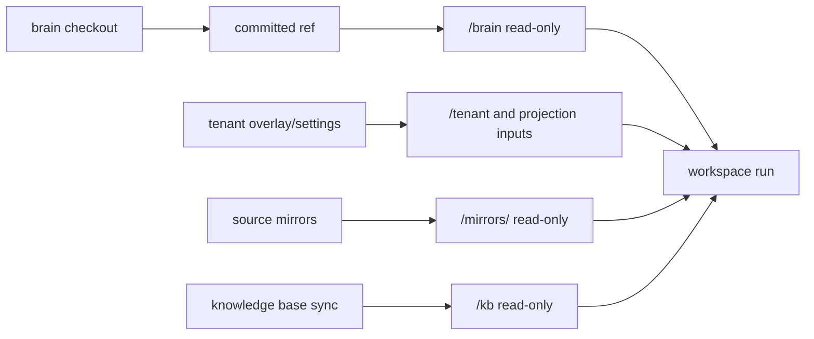

# Brain Model

A brain checkout is the project-owned knowledge and tooling tree RootCause mounts read-only for a run.
It is external-developer facing: no private RootCause source, host credentials, or infrastructure shell
is required to work on it.

## Layout

| Path | Purpose |
|---|---|
| `.rootcause.toml` | Committed non-secret project binding, optional tenant metadata, and optional `[mirrors]` local checkout paths relative to the brain root. `rc` uses the binding and ignores unknown tables. |
| `.env` | Gitignored grounding secrets for Local Brain Work live checks. Pull with `rc project env pull`. |
| `.env.action` | Gitignored sealed write credentials for local hosted-Python action tests. Only `brain_action.py` uses it. |
| `AGENTS.md` | Local instructions for agents working in that brain repo. |
| `skills/` / `playbooks/` / notes | Durable knowledge and project-specific scripts a run may read. |
| `skills/<topic>/scripts/*.py` | Grounding scripts; import `from lib import db/fs/http/...` from `rootcause-runtime`. The offline lint rejects Python outside `skills/`, `actions/`, and `tests/` (root `conftest.py` is allowed), ensuring import smoke's intentional `skills/**` scope covers every grounding script. Resolve source checkouts with `lib.fs.mirror_path()` / `mirror_scripts()`. |
| `tests/`, fixtures | Brain-local test fixtures; safe to commit when project-specific. |
| `actions/<id>/` | Optional action catalog: manifest plus script/preflight. Proposal is in-loop; execution is gated later. |
| `.replypenignore` | Canonical root run-visibility rules for committed maintainer-only content. |
| `.rcignore` | Supported internal/legacy alias; its ignored set is unioned with `.replypenignore`. |
| `.rootcause/` | Gitignored local artifacts: debug dumps, projection previews, run dumps. Never commit. |

## Audience And Ownership

This kit is for project developers and their AI agents working from a brain checkout. It should teach
enough production context to let them improve the brain and recognize RootCause support boundaries,
without requiring private RootCause source, host shells, SSM, registry database access, or operator
scripts.

The brain is the project's owned instruction layer. Put business context here: product vocabulary,
support policies, escalation/playbook decisions, grounding scripts, tests, projection templates, and
action manifests. Do not put private RootCause host mechanics, secrets, generic system-prompt rules, or
brand voice/language/signature defaults here; rootcause persona settings own those at project, tenant,
and mailbox scope.

## Brain Versus External Context

At runtime the main loop may receive several read-only sources. They are complementary, not
interchangeable.

| Source | Mounted as | What belongs there | What the brain should say about it |
|---|---|---|---|
| Project brain | `/brain` | Durable business context, terminology, routing, playbooks, scripts, fixtures, projection templates, action catalog. | Which brain files/scripts answer which classes of questions, and how to decide in project terms. |
| Tenant brain/overlay | `/tenant` and/or compiled `/brain` | Tenant-specific labels, local policies, settings-driven substitutions, and domain exceptions. | Shared rules that are safe for all tenants, plus projection templates when the shared brain compiles tenant views. |
| Source mirrors | `/mirrors/<name>` | Customer application code, schemas, config, runbooks, or other source-controlled repositories mirrored by RootCause. | Which repo/file areas explain behaviors; do not copy code facts that should be read from mirrors. |
| Knowledge base | `/kb` | External support docs or synced knowledge sources, when configured. | When to consult KB material and how it should rank against committed brain playbooks. |
| Shared file-format skills | `/skills` | RootCause-owned, cross-project xlsx/csv/pdf reading and writing skills; their libraries (openpyxl, pandas, pypdf, pdfplumber, fpdf2) are baked into the workspace image. | Nothing — don't reinvent file parsing in a brain; point at `/skills` and describe only project-specific file layouts. |
| Grounding databases/APIs | `lib.db`, `lib.http`, etc. | Live read-only facts: customers, orders, invoices, app state, remote API data. Runtime-owned HTTP attempts emit the [HTTP audit contract](http-audit.md). | How to query safely, which scripts encapsulate repeated lookups, and what findings mean for the customer. |
| Actions | `actions/<id>/` plus host catalog | Vetted write intents, parameter schemas, read-only preflight, optional hosted execution script. | When an action is the right resolution, required evidence for params, and reviewer-facing caveats. |

`lib.db` hydrates Postgres array columns into real Python lists — `enum[]` included, which psycopg
itself hands back as the raw `"{parent,child}"` literal. A brain that runs against an **older pinned
runtime** can still see that literal, so keep boundary code shape-tolerant — normalize once
(`if isinstance(v, str): ...`) instead of assuming one shape, and never iterate the value blind (a
literal string iterates as characters).

If a fact changes with the customer's app state or source code, prefer a grounding script or mirror
lookup over copying it into prose. If a fact is a stable support policy, product concept, customer
promise, or decision tree, put it in the brain with tests where practical.

## Execution Context Boundary

Do not mix the local control plane with the production model's workspace:

| Context | Available interface | Brain access | Instruction home |
|---|---|---|---|
| Local brain-development agent | Public `rc` CLI after OAuth, local engine scripts, local shell | Writable checkout | This kit's locally installed skills and docs |
| Production main LLM loop | `bash` plus the scenario terminal tool (`reply` for email); `/brain` scripts and injected `lib.db`, `lib.cloudwatch`, `lib.http`, `lib.fs`, `lib.connectors`, `lib.api`, `lib.mcp` as configured | `/brain` read-only | Committed project business context, routing, playbooks, and grounding scripts |

There is no `rc` binary in the production loop. Never put `rc ...` command guidance in committed
project-brain content: it cannot execute there and competes with the actual grounding path. A brain
may name required evidence, a `/brain` script, a mirror/KB path, or an injected `lib.*` capability;
local CLI orchestration stays in this kit.

## Author For Navigation

Brains work best when the first useful file routes by the customer's words, then points to concrete
evidence. Keep routing docs short and usually read-only for orientation: they should tell the run what
to open next, but the selected/baked context should normally be the exact runbook, action doc, source
file, KB article, script, or fixture that proves the answer.

For each common area, prefer compact tables over prose. `Check` is what the run should do next;
`Evidence to open` is the concrete file/path/event that should be selected or cited.

| Customer symptom language | Check | Evidence to open | Action / no-action rule |
|---|---|---|---|
| "I was charged twice" / duplicate payment | Run the charge lookup script; search payment logs for duplicate capture events | Billing runbook, `/mirrors/app/.../payments/`, refund KB article, `actions/refund/` guards | Propose refund only when the duplicate-settlement guard passes; otherwise explain pending auth or escalate |
| "I cannot log in" / expired invite or SSO failure | Query user/invite state; search auth logs for invite or SAML errors | Access runbook, `/mirrors/app/.../auth/`, KB article for SSO reset, trace events from the failed run | Send reset steps for normal expiry; escalate tenant SSO config or source bug evidence |
| "The report total looks wrong" / revenue dashboard mismatch | Run the report fixture or query; source-search the metric definition and freshness job | Reporting runbook, `/mirrors/warehouse/.../revenue.sql`, dashboard source, fixture with expected totals | Usually no action: explain freshness/definition, or file a support/source issue with exact evidence |

Useful brain conventions:

- Add a short routing index: symptom phrases -> exact runbook/action/source areas.
- In runbooks, name source mirror paths, source files, log events, DB/helper scripts, and `rg` terms
  where known.
- Maintain a small source map when source mirrors are important: product area -> `/mirrors/<name>/...`
  paths -> useful search terms, classes, jobs, routes, or log events.
- If KB snapshot filenames are opaque, add searchable titles/frontmatter or an index that maps customer
  article titles to `/kb` paths. For traversal examples, see [knowledge-base.md](knowledge-base.md).
- Put customer symptom language beside internal feature names so support emails and source searches
  meet in the same doc.
- For action-backed outcomes, route to the action doc's safety guards and verification checks before
  suggesting proposal.

### Routing row vs. the auto tree

The host renders a budgeted (~500-line) glossed file tree of the brain (and each mirror) into every
run's context, one line per file with its `description:`/docstring gloss. So a routing row is not free
orientation — it either adds reach the tree can't, or duplicates a line the tree already carries. Add
one only when it does the former:

- **Redundant — skip it.** The target already renders as its own tree line with a `description:` gloss,
  and it's shallow and well-named. The gloss carries it; a row that just restates a visible, glossed
  file burns tokens on every run.
- **Relevant — write it** when at least one holds:
  1. **The tree can't show the target** — it lives ≥2 levels inside a dir the budget capped or
     collapsed (huge uniform families like `platforms/<provider>/…`, flat archives like a 1k-file FAQ
     dir), so the tree prints only `… (N files, M dirs)` and the file is invisible.
  2. **Lexical gap** — customers' words don't match the filename/path; the row bridges their vocabulary
     to the path (retrieval is lexical `rg` over customer words — see the grounding checklist below).
  3. **Uniform family** — write ONE pattern row with a `<placeholder>` that teaches the whole shape
     (`platforms/<provider>/{oauth,pull,restore}/`); never enumerate members.
  4. **Irregular family** — prefer a short mirror-map or `INDEX.md` note over many one-off rows.
- **Mechanics.** A path named in a routing row becomes a tree **PriorityPath**: protected from
  collapse, so the row is also the lever that keeps an otherwise-capped dir line visible. Keep rows to
  one line, symptom-phrased in customer vocabulary, and current when files move.
- **Don't hand-maintain a Layout tree** in `AGENTS.md` — it duplicates the auto tree and rots. Align
  with it; add rows only for what the auto tree can't reach.

## Production Prompt Boundary

The production loop also sends standing instructions from RootCause itself, currently in
`rootcause/internal/agent/prompt.go`. Brain docs and shipped skills should stay consistent with that
mindset instead of restating it.

For email runs, `emailPreamble` already tells the model that it is drafting a grounded customer reply
for human review; the draft is customer-facing plain language; technical internals stay out of the
draft; the note is a short plain-language reviewer brief; and actions must not be claimed as done
unless verified by the flow. The shared system prompt already covers the fresh container, read-only
`/brain` and `/mirrors`, writable scratch, grounding mandate, journal path, and terminal-tool finish.
Capability-gated prompt sections cover source PRs, actions/preflight, PII tokens, DB scoping, mirror
rosters, DB helper usage, and run time.

Brain content should therefore focus on project specifics:

- product terms, names, and tone choices the generic prompt cannot know;
- which evidence to gather and which scripts/playbooks to open;
- customer promises, support policy, escalation criteria, and action-selection rules;
- what belongs in the customer-facing reply versus what the reviewer needs to know for this project.

Do not duplicate generic rails such as "be grounded", "do not invent", "finish with the tool", raw
`lib.db` helper syntax, or the generic draft/note split unless the project has a narrower local rule.
`queryPreamble` is a separate machine-facing/raw-data mode; mention it only when a brain rule would
otherwise wrongly force customer tone, localization, or identifier hiding into raw investigations.

### The `include_in` contract — hard-loading a doc into a host prompt

`include_in` is a **YAML list** in a brain `.md`'s frontmatter. The **tag** is the contract, never the
filename, and one doc can feed several host prompts (`include_in: [grounding, agent]`). Each tag pastes
the doc's **full body** into a different host-assembled prompt:

| Tag | Who holds it | What belongs there | Caps (per file / total) |
|---|---|---|---|
| `triage` | the **gatekeeper** — the cheap process-vs-skip classifier | decline / ownership / scope knowledge (convention: root `triage.md`) | 8KB / 24KB |
| `grounding` | the **file-picker** — the cheap retrieval pre-step that chooses which files the main agent starts with | always-load-bearing **orientation** maps: system map, domain glossary | 8KB / 24KB |
| `agent` | the **answer-writer** — the main loop, pasted right after `AGENTS.md` | **reference** material the writer must hold in full: schema/column maps, identifier tables, field lists | 16KB / 48KB |

Pick the role by asking **who must hold the doc**. The pre-step only forwards `path:span` refs
*probabilistically*; if the main agent must **always** have the content — not just when a selector deems
it relevant — tag `agent`. The tag is a guarantee; span selection is not. A doc tagged both `grounding`
and `agent` is marked in the selector's context as "already auto-pasted to the main agent", so the
selector doesn't waste selections re-forwarding it.

Standing rule for every role: **tag sparingly**. Each tagged doc is a per-run token tax on every thread;
the caps are a safety net, not a budget. `AGENTS.md` inclusion depends on its mount:

| Path | Grounding pre-step | Main agent |
|---|---|---|
| `/brain/AGENTS.md` | automatic | automatic |
| `/tenant/AGENTS.md` | selectable; tag `grounding` only to guarantee it | automatic, after the project brain |
| `/mirrors/<repo>/AGENTS.md` | explicit `grounding` tag | explicit `agent` tag |

Use both tags when both consumers must hold a mirror's instructions. Do not tag `/brain/AGENTS.md`, and
do not add the redundant `agent` tag to `/tenant/AGENTS.md`. Triage is separate: every file, including
`AGENTS.md`, needs an explicit `triage` tag. A pointer line in `AGENTS.md` is **not** a substitute for an
`agent` tag — the model will not burn a turn following a pointer mid-task.

Scan scope for the `grounding`/`agent` roles: the whole brain plus any bound tenant brain; a **mirror**
file is only picked up at the repo root as `*.md` or under `doc/`, `docs/`, `.claude/`, `.agents/`;
`/kb` never. Truncation past a cap appends an explicit marker — the agent may read the rest with `bash`.

### Run-visible filesystem boundary (`.replypenignore`)

Use a root `.replypenignore` when committed maintainer-only content must be physically absent from a
production run. `.rcignore` is a supported internal/legacy alias. Both use gitignore syntax; when both
exist, RootCause unions their ignored sets. Negation only reverses an earlier rule in the same file—it
cannot reveal a path hidden by the other control.

The boundary applies to every file type in project brains, tenant brains, and source mirrors. When a
control exists, RootCause materializes a Git-history-free view with ignored paths and both control files
removed. The mount, auto-rendered trees, `include_in` discovery, grounding selection, baked references,
evaluation workspace, and customer brain viewer all use that same view. Reads, copies, unsafe symlinks,
and path-normalization failures abort visibility processing; they never fall back to the raw source.
Without either control file, the original source remains on the zero-copy path.

Ignore the canonical source-of-truth path only. A safe relative symlink to ignored in-repo content is
omitted automatically; do not duplicate the rule for compatibility aliases. Absolute, escaping, broken,
or otherwise unsafe symlinks still abort visibility processing. This target-aware omission is a
RootCause visibility extension; ordinary gitignore matching considers the symlink entry path itself.

Use normal Git patterns: comments/blank lines, escaped leading `#` or `!`, rooted paths, directory
patterns, `**`, and `!` negation. `exclude_in` frontmatter is not a visibility feature and is treated as
ordinary unknown metadata.

Default to hiding committed files that help maintainers verify the brain but do not help a production
run answer a customer: unit/integration tests, test-only fixtures, coverage output, build artifacts,
internal design notes, and local tooling. Keep them committed and runnable locally; remove them only
from the run-visible view. Typical rules are `/tests/`, `/skills/**/tests/`, `/actions/**/tests/`, and
`/conftest.py` (adapt to the repo rather than copying blindly).

Agent skill trees in a source mirror (`.claude/skills/`, `.agents/skills/`) are domain knowledge, not
harness config: keep each skill folder **whole**, including its progressive-disclosure margin files —
a visible `SKILL.md` whose linked files are hidden is worse than either extreme. More generally, keep
top-level markdown that gives a high-level view of a subsystem even when it is about implementation;
"how this feature is built" routinely answers "why did the customer see X". Hide a skill or doc only
when it would actively mislead the run agent because it documents tooling the run does not have —
local control-plane guidance (e.g. the `rc` CLI skill), operator-only workflows wired to hidden
scripts — or internal meta files (harness settings, slash-commands, agent memory, pentest state) that
read as instructions rather than knowledge. When unsure, keep it visible.

Do not expose a test suite merely because it demonstrates a script's inputs or outputs. Put the stable
contract in the script docstring, its `SKILL.md`, or a concise reference/example instead; that is easier
to retrieve and costs less context. Keep a test or fixture visible only when the production run has an
explicit diagnostic workflow that reads or executes it and its contents are safe for the runtime
audience. This is a relevance boundary, not a secrecy substitute: ignored files still live in Git.

### Feeding the triage gate (`include_in: [triage]`)

Before the main loop runs, a cheap **triage** classifier decides process-vs-skip. Its prompt is built
from the operator's tunable triage guidance plus the full body of every project-brain `.md` whose
frontmatter declares `include_in: [triage]`. Nothing is automatic, including `AGENTS.md`. Use the tag to
teach triage the project's **decline / ownership / scope** rules
— semantic topic categories that are not owned by this mailbox, broad notification classes, and
wrong-addressee patterns that require judgement.

```markdown
---
description: Which automated/off-topic mail this inbox declines without a reply.
include_in: [triage]
---
```

Conventions: keep it **short** (it rides every triage call) and in **customer language** — a skip can be
quoted back to the mailbox owner as feedback. It is context, not a hard rule: deterministic rules and
the default bias to process still win, and skips are always reviewable (feedback note + override), so a
brain can inform triage but never silently black-hole mail. Recommended home is a `triage.md` at the
brain root.

**Exact allow/block selectors belong in settings, never in the brain.** A sender address/domain,
subject/header match, or other deterministic blacklist/whitelist must be configured with
`rc project triage rules` (`effect=skip|force_process`). Spam allow/block entries use
`rc project senders`. Do not duplicate these selectors in `AGENTS.md`, `triage.md`, a skill, or a
brain test: settings run before brain-guided judgement and are the UI's source of truth.

### Feeding the grounding pre-step (`include_in: [grounding]`)

A file tagged `include_in: [grounding]` has its **full body hard-loaded into the grounding pre-step's
turn-1 on every thread** — pasted right after `/brain/AGENTS.md` so the cheap file-selector starts
**oriented** — and, unlike `AGENTS.md`, it stays fully **selectable**, so the pre-step still forwards its
`path:span` refs to the main agent when relevant. Reserve it for a project's **always-load-bearing
overviews** (a system map, the core glossary) and **never** for case runbooks or FAQ items — that
per-topic content is retrieval's job, fetched on demand.

The trap: this tag reaches the **selector only**. The main answer-writing agent never sees the body — it
sees, at best, a forwarded span. If the content must be in the writer's hands, add `agent`.

### Feeding the main agent (`include_in: [agent]`)

A file tagged `include_in: [agent]` is pasted into the **main loop's bootstrap**, right after
`AGENTS.md` — the answer-writer holds it in full, every run, guaranteed. Reserve it for **reference**
material the writer cannot afford to guess at: schema/column maps, identifier tables, enum/field lists.
Bigger caps (**16KB** / **48KB**) because reference tables are bigger than orientation maps — not
because the budget is looser.

**Worked example — the cautionary tale.** kampadmin-staff's `skills/records/schema.md` is a verified
"guessed → real column names" SQL map, and it was tagged `[grounding]` only. The selector saw it every
run but forwarded its path in just 1 of 3 relevant runs — while the **main** agent wrote 100% of the
SQL. In the 2026-08-03 fleet review, **76% of 25 sampled SQL failures were guessed identifiers already
mapped in that file** (`first_name`→`firstname`, `tenants.code`→`client_codename`,
`admin_users`→`admins`, …). Fix: retag `[grounding, agent]`. Lesson: **a schema map that only reaches
the retrieval pre-step is invisible to the model that queries the database.**

### Writing for grounding — author checklist

Before the main loop, a cheap grounding pre-step routes by tree glosses and lexical `rg`, then bakes
its selection into the model's opening turn. Every upfront line is a router hook bought with tokens;
an irrelevant one is an active distractor. Checklist:

- `description:` frontmatter on every `skills/*/SKILL.md`, `skills/cases/*.md` runbook, and
  `actions/*/manifest.yaml` — "when to open this" in customer vocabulary, ≤90 chars for Markdown.
  Action descriptions also feed the full catalog and may stay rich; lead those with one complete
  routing sentence that fits within 90 chars. The offline lint preserves this distinction.
- Python scripts: first docstring line = **usage + purpose** — e.g. `backup_status.py <backup-id> —
  why-isn't-this-backup-running triage.` It is the script's tree gloss and the only line an agent sees
  before calling, so teach the invocation, not just the topic.
- Single-identifier scripts take the identifier **positionally *and* by flag**: argparse positional
  `nargs="?"` next to the flag, merged post-parse, error when the two disagree. An agent's first guess
  is positional (`backup_status.py 116672`), so a flag-only script burns a turn on every run — 72
  wasted calls in one fleet window. Pattern: `skills/pb-admin-api/scripts/context_dump.py`
  (`email_arg` + `--email`, merged in `_parse_email`).
- argparse errors carry a copy-pasteable invocation — ``backup id required — e.g. `backup_status.py
  116672` `` — the error text is all the agent has to retry from.
- Never rename an established script or function; agents pattern-match names across runs. If
  production keeps guessing a name that doesn't exist, add a one-line alias instead of failing it.
- `include_in: [triage]` — decline/ownership/scope rules triage must know; short, it rides every
  triage call (subsection above).
- `include_in: [grounding]` — only always-load-bearing overviews; it taxes every thread, never
  runbooks or FAQ items (subsection above).
- `include_in: [agent]` — reference the answer-writer must hold in full (schema/column maps, identifier
  tables). If the main agent guessing wrong is a real failure mode, a `grounding` tag alone won't save
  it (subsection above).
- `.replypenignore` — physically remove committed maintainer-only paths from every run-visible surface;
  default-hide tests/test fixtures unless a production diagnostic explicitly uses them, and never use
  `exclude_in` frontmatter for visibility.
- Customer language everywhere — filenames, descriptions, `AGENTS.md` routing rows; retrieval is
  lexical `rg` over the words customers write, so a correct doc missing those words is invisible.
- Flat archives (e.g. FAQ imports): greppable frontmatter facets on every item plus a generated
  `INDEX.md` with facet counts and exact `rg` recipes; the tree caps large dirs, so never rely on
  filename enumeration.
- `journal/` is host-written and renders as one counts line; never hand-author it.
- `AGENTS.md` routing rows map symptom phrases to exact file paths; named paths are pinned in the
  tree, so keep them current when files move.
- Before committing: `uv run "$SKILL/scripts/brain_test.py"` (offline tier; includes the
  description lint, no DSN needed).

## Production Mounts


```mermaid
flowchart LR
    C["brain checkout"] --> P["committed ref"]
    P --> B["/brain read-only"]
    T["tenant overlay/settings"] --> O["/tenant and projection inputs"]
    M["source mirrors"] --> R["/mirrors/<name> read-only"]
    K["knowledge base sync"] --> KB["/kb read-only"]
    B --> W["workspace run"]
    O --> W
    R --> W
    KB --> W
```

Only committed, run-visible files travel to `/brain`. Root `.replypenignore` / `.rcignore` rules remove
maintainer-only committed paths; untracked or gitignored local kit installs, `.env`, dumps, and test
artifacts stay on the laptop.

## Project And Tenant Brains

- A project/shared brain holds shared grounding scripts, playbooks, projection templates, and the
  shared action catalog.
- A tenant brain, when present, holds tenant-specific natural-language overlay. Tenant values may live
  in RootCause settings rather than committed files.
- A templated project brain may compile a tenant-specific `/brain` view from `projection.yaml` plus
  tenant profile values. Preview locally with `brain_projection.py` when present;
  `rc dev brain render --tenant <slug>` prints the server-compiled view exactly as `/brain` mounts it.

## Channels And Refs

- Flat projects often read `main` directly.
- Tenant-enabled shared project brains usually read a channel ref such as `stable` or `edge`, recorded
  in run trace as `brain_resolved`.
- `rc ask --brain-ref dev/<branch>` tests a pushed dev ref on production infrastructure without moving
  `main` or promoting a channel.
- `rc dev brain publish --channel stable|edge --sha <exact-full-40-character-sha>` is the one-shot
  path (sync + promote + verify); `rc dev brain sync` / `promote` are the same steps taken separately.
  Only a project-level maintainer may move a shared project channel. `rc dev brain preflight` dry-runs
  the promotion per tenant first. See [`brain-publish`](../skills/brain-publish/SKILL.md).
- Tenant brains typically use their `main` HEAD; shared project brain promotion is separate.
- A `main` status of `current` does not prove a channel is current. Verify the intended channel's
  resolved SHA in `rc dev brain status --scope project -o json` (without `--scope project` a tenant
  context answers about the tenant overlay brain) or in a normal run's `brain_resolved` trace.

## Local Engine Boundary

Local Brain Work (`local-brain-work`) reproduces grounding scripts, test tiers, action preflight/local hosted-Python execution,
and projection previews. It does not run a private copy of the production LLM loop. Use `rc ask` and
`rc run debug <id>` for full production-loop evidence.
