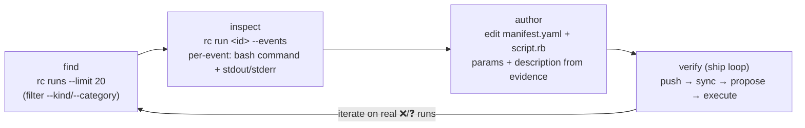

# `rc` — the project's self-service window into its own rootcause data

`rc` (repo: **`rootcause-org/rootcause-cli`**) is a thin Go CLI that lets a **project consume its OWN
rootcause data and change its own config** — over rootcause's public JSON `/api/v1`, authed with
the project's existing **Prompt API bearer key**. No business logic lives in it (MCP is a planned layer
over the same endpoints); it's a typed, paginating, TTY-aware front-end to the API.

> **Why it's documented in this kit.** This repo is the *customer-world-facing, infra-free* brain
> tooling — the litmus test ([AGENTS.md](../AGENTS.md)) is "does it touch OUR host?". `rc` does **not**:
> it speaks the public API with the project's own key, so it's the **project-dev's read-side
> counterpart** to the operator-only host-debug tools (`db.py`, trace/`logs.py`, `rc_*_debug.py`) that
> stay in `rootcause`. A dev with no operator/SSM access can still ground themselves in real runs.
> `rc` lives in its own repo; this page is where the **author→verify loop** that uses it is taught.

## Commands (progressive disclosure: index → one run → detail)

```bash
rc ask "<customer-style question>"      # trigger a REAL prod run; prints the run_id   (POST /api/v1/runs)
rc ask "<q>" --brain-ref dev/x          # …against a pushed dev/* branch — NO main push, main stays live
rc status                       # recent runs + health summary           (GET /api/v1/runs)
rc runs [--limit N] [--kind email|prompt|mcp|analysis] [--category ok|timeout|...]
rc run <id>                     # one run, high level: status, category, draft?/note?, cost, duration (+ kind/outcome/turns/bash/created/finished/trace)
rc run <id> --events            # full detail: per-event trace — bash command + stdout/stderr, exit code, timing
rc run <id> --full -o json      # the whole run-dump BUNDLE ({run, events}) — what brain_dump.py renders  (GET /api/v1/runs/{id}/full)
rc config get                   # effective settings + box defaults
rc config set max_run_usd=5 default_tier=pro
rc env keys                     # key NAMES of the project's PRODUCTION grounding .env (log-safe)  (GET /api/v1/env)
rc env pull                     # write that env to a 0600 ./.env (so brain-dev --live can run grounding locally)
rc env diff                     # names-only drift: local ./.env vs the server (nonzero exit on drift)
rc login                        # store THIS brain's API key in a gitignored .rootcause.secret.toml (0600)
rc whoami                       # which project will rc hit from here, and why (brain binding + key source)
```

- **`rc ask` is the high-fidelity loop test.** It runs the *real* prod loop (model, egress, `/brain:ro`,
  `/mirrors`, KB) — `--brain-ref dev/x` fetches a pushed `dev/*` branch so a brain change is tested on
  real infra **without** moving `main` (which is live). The run is **side-effect-free**: no callback,
  no journal push, and any proposed action/PR is flagged `test`. Dump it with the `brain-dev` skill's
  [`brain_dump.py`](../skills/brain-dev/SKILL.md#test-a-brain-change-on-real-prod-infra--without-pushing-main-rc-ask--brain_dumppy)
  (`rc run <id> --full` → the shared `run_dump` renderer → an index `.md` + jq-queryable `.jsonl`).

- **Output is TTY-aware** — pretty table on a terminal, **JSON when piped** (`rc runs | jq …`); force
  with `-o json|table`.

### Auth — the brain checkout selects the project (no `--profile`, no env wrangling)

A brain repo **is** one project, so `rc` binds to it by convention: run `rc` anywhere inside a brain
clone and it targets *that* project. Two files make this work — one committed, one not:

| File | Committed? | Holds | Role |
|---|---|---|---|
| **`.rootcause.toml`** | ✅ yes | `project = "<slug>"`, `base_url = "…"` | the binding — ships with the clone, so the project + endpoint are known out of the box |
| **`.rootcause.secret.toml`** | ❌ gitignored | `api_key = "…"` | the token, written by `rc login`, never committed |

Resolution precedence (per field; an env var always wins as a one-off override):

```
explicit --profile <name>        → that profile only (AWS-style override; no brain binding)
otherwise, inside a brain:         env > .rootcause.secret.toml > [profiles.<slug>] > LOUD ERROR
otherwise, outside any brain:      env > [default] > built-in default
```

The **loud error** is the point: inside a brain with no key, `rc` names the project and refuses —
it will **never** silently fall back to a global `[default]` (the footgun where running `rc` in the
Momentum repo quietly hit a different project). `rc whoami` shows what it resolved (and confirms the
project with the server); `rc env pull`/`ask`/`run` all honor the same binding.

**Onboard a brain (incl. an external customer who just cloned):**

```bash
git clone …/rootcause-brain-<project> && cd rootcause-brain-<project>   # .rootcause.toml already inside
rc login            # paste the project's Prompt-API key once → writes .rootcause.secret.toml (0600)
rc whoami           # confirms: project, base URL, key source, server agrees
rc ask "…"          # just works — no --profile, no export
```

`rc login` verifies the key against the server and **refuses** to store it if it resolves to a
different project than `.rootcause.toml` names (catches a pasted wrong key). The committed
`.rootcause.toml` carries `base_url`, so a customer hits the right endpoint with zero env setup; only
the secret key is theirs to add. The global `~/.config/rootcause/config.toml` (env vars / named
profiles) still works as an override and for non-brain use — same bearer key, **never committed**.

**Tenant brains.** A delta repo over a tenant-enabled project (e.g. a single clinic under DentAI) adds
a `tenant` field to its marker — `project = "dentai"`, `tenant = "de-kies"`. `rc` then defaults
`--tenant` for `ask`/`env`/`whoami` to that tenant, so the checkout resolves the **project ∪ tenant**
scope without repeating the flag. The key is the *project* key (`rc login` with DentAI's key); the
tenant just scopes it.

## Install

**No Go needed** — grab a prebuilt binary (cross-compiled per release by GoReleaser).

```bash
# Homebrew (macOS/Linux):
brew install rootcause-org/tap/rc

# Or a prebuilt binary: pick your OS/arch on the releases page, then (macOS arm64 example —
# substitute the real version + your arch from the asset you downloaded):
curl -sSL https://github.com/rootcause-org/rootcause-cli/releases/latest/download/rc_<ver>_darwin_arm64.tar.gz \
  | tar -xz && sudo mv rc /usr/local/bin/ && rc --version
# macOS Gatekeeper may quarantine the unsigned binary: xattr -d com.apple.quarantine $(which rc)

# Go devs:
go install github.com/rootcause-org/rootcause-cli/cmd/rc@latest
```

Binaries + the Homebrew formula are published per `vX.Y.Z` tag (see the
[releases page](https://github.com/rootcause-org/rootcause-cli/releases)). Cut a release with
`scripts/release.sh patch|minor|major` from the `rootcause-cli` repo.

## The author → verify loop — ground in real runs *before* you write an action

This is the headline `rc` unlocks, and the standard this repo now teaches: **don't author an action
(or any brain change) blind — verify against real data first.** Before you write or change an
`actions/<id>/`, inspect exactly what the agent actually did on real cases, then author from evidence.



1. **Find relevant cases** — `rc runs --limit 20`, narrowing with `--kind` / `--category`, to surface
   the real runs your action is meant to handle (e.g. the timeouts, the refunds, the failures).
2. **Inspect what the agent did** — `rc run <id> --events` shows the full per-event trace: each tool
   call with its exact bash/grounding command, its stdout/stderr, plus exit code and timing (and the
   reply's draft/note markers). This is the ground truth for *which params the action needs* and *what
   its `description` must say* so a future run reaches for it.
3. **Author from evidence** — only now edit `actions/<id>/{manifest.yaml,script.rb}`. The param schema
   and `description` are shaped by what you saw, not by a guess.
4. **Verify it's live and works** — push → sync → propose → execute, the loop in
   [`ship-and-verify.md`](../skills/brain-dev/ship-and-verify.md) (and the concept in
   [`actions.md`](actions.md)). `rc run <id> --events` is also how you read back the run you triggered
   in *Mode A* ("did the agent reach for the action, with the right params?") **without** operator host
   access.

The same verify-first discipline applies to **value/env conventions**: `rc config get` shows the
effective settings + box defaults you're authoring against (e.g. `max_run_usd`, `default_tier`), so you
tune config to what's actually live rather than to assumptions.

## Sync the grounding env (`rc env`)

A brain's grounding scripts read their credentials (the `*_DSN`s, API keys) from a **gitignored
`./.env`** at the brain root. `rc env` lets a **project dev self-serve** that env — the same role the
operator-only `scripts/rc_env.py --pull` plays, but over the **Prompt API key** instead of AWS/SSM, so
no operator access is needed:

```bash
rc env keys                 # what keys exist (NAMES only — safe to paste/log)
rc env pull                 # fetch the PRODUCTION grounding .env → write 0600 ./.env
rc env diff                 # has my local ./.env drifted from prod? (names-only; exit≠0 on drift)
rc env pull --tenant <slug> # tenant-enabled project (e.g. dentai): the project ∪ tenant env a run sees
```

Pull it once and `brain-dev`'s **`--live`** tier can run grounding scripts against real prod data
locally. **Secret hygiene:** no subcommand ever prints a secret VALUE (`pull` writes them only to the
0600 file; `keys`/`diff` are names-only). The pulled `.env` holds **real production secrets** on your
laptop — it's gitignored in every brain; treat it like a password file.

## Related

- [`actions.md`](actions.md) — the action plane + the author→test loop (`rc` is the *ground-first* step
  that precedes it).
- [`ship-and-verify.md`](../skills/brain-dev/ship-and-verify.md) — the outer push→sync→feedback loop;
  `rc run <id> --events` is the project-dev way to read a triggered run's trace.
- [`brain-dev` SKILL](../skills/brain-dev/SKILL.md) — the local, read-only diagnosis counterpart.
