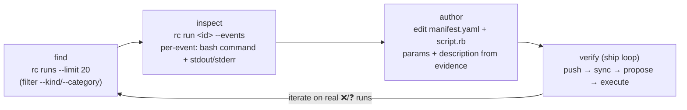

# `rc` — the project's self-service window into its own rootcause data

`rc` (repo: **`rootcause-org/rootcause-cli`**) is a thin Go CLI that lets a **project consume its OWN
rootcause data and change its own config** — over rootcause-light's public JSON `/api/v1`, authed with
the project's existing **Prompt API bearer key**. No business logic lives in it (MCP is a planned layer
over the same endpoints); it's a typed, paginating, TTY-aware front-end to the API.

> **Why it's documented in this kit.** This repo is the *customer-world-facing, infra-free* brain
> tooling — the litmus test ([AGENTS.md](../AGENTS.md)) is "does it touch OUR host?". `rc` does **not**:
> it speaks the public API with the project's own key, so it's the **project-dev's read-side
> counterpart** to the operator-only host-debug tools (`db.py`, trace/`logs.py`, `rc_*_debug.py`) that
> stay in `rootcause-light`. A dev with no operator/SSM access can still ground themselves in real runs.
> `rc` lives in its own repo; this page is where the **author→verify loop** that uses it is taught.

## Commands (progressive disclosure: index → one run → detail)

```bash
rc status                       # recent runs + health summary           (GET /api/v1/runs)
rc runs [--limit N] [--kind email|prompt|mcp|analysis] [--category ok|timeout|...]
rc run <id>                     # one run, high level: status, category, draft?/note?, cost, duration (+ kind/outcome/turns/bash/created/finished/trace)
rc run <id> --events            # full detail: per-event trace — bash command + stdout/stderr, exit code, timing
rc config get                   # effective settings + box defaults
rc config set max_run_usd=5 default_tier=pro
```

- **Output is TTY-aware** — pretty table on a terminal, **JSON when piped** (`rc runs | jq …`); force
  with `-o json|table`.
- **Auth/config** — `ROOTCAUSE_API_KEY` + `ROOTCAUSE_BASE_URL` env, or
  `~/.config/rootcause/config.toml` profiles. (Same bearer key the project already uses for the Prompt
  API — no new secret, and **keys live in env/config by name**, never committed.)

## Install

**No Go needed** — grab a prebuilt binary (cross-compiled per release by GoReleaser).

```bash
# Homebrew (macOS/Linux) — once the tap is published:
brew install rootcause-org/tap/rc

# Or a prebuilt binary: pick your OS/arch on the releases page, then e.g. (macOS arm64):
curl -sSL https://github.com/rootcause-org/rootcause-cli/releases/latest/download/rc_<ver>_darwin_arm64.tar.gz \
  | tar -xz && sudo mv rc /usr/local/bin/ && rc --version

# Go devs:
go install github.com/rootcause-org/rootcause-cli/cmd/rc@latest
```

Binaries live on the [releases page](https://github.com/rootcause-org/rootcause-cli/releases) — they
appear once a `vX.Y.Z` tag is cut (until then, `…@main` or build from source).

## The author → verify loop — ground in real runs *before* you write an action

This is the headline `rc` unlocks, and the standard this repo now teaches: **don't author an action
(or any brain change) blind — verify against real data first.** Before you write or change an
`actions/<id>/`, inspect exactly what the agent actually did on real cases, then author from evidence.



1. **Find relevant cases** — `rc runs --limit 20`, narrowing with `--kind` / `--category`, to surface
   the real runs your action is meant to handle (e.g. the timeouts, the refunds, the failures).
2. **Inspect what the agent did** — `rc run <id> --events` shows the full per-event trace: each tool
   call with its exact bash/grounding command, its stdout/stderr, plus exit code and timing (and the
   reply's draft/note markers). This is the ground truth for *which params the action needs* and *what
   its `description` must say* so a future run reaches for it.
3. **Author from evidence** — only now edit `actions/<id>/{manifest.yaml,script.rb}`. The param schema
   and `description` are shaped by what you saw, not by a guess.
4. **Verify it's live and works** — push → sync → propose → execute, the loop in
   [`ship-and-verify.md`](../skills/brain-dev/ship-and-verify.md) (and the concept in
   [`actions.md`](actions.md)). `rc run <id> --events` is also how you read back the run you triggered
   in *Mode A* ("did the agent reach for the action, with the right params?") **without** operator host
   access.

The same verify-first discipline applies to **value/env conventions**: `rc config get` shows the
effective settings + box defaults you're authoring against (e.g. `max_run_usd`, `default_tier`), so you
tune config to what's actually live rather than to assumptions.

## Related

- [`actions.md`](actions.md) — the action plane + the author→test loop (`rc` is the *ground-first* step
  that precedes it).
- [`ship-and-verify.md`](../skills/brain-dev/ship-and-verify.md) — the outer push→sync→feedback loop;
  `rc run <id> --events` is the project-dev way to read a triggered run's trace.
- [`brain-dev` SKILL](../skills/brain-dev/SKILL.md) — the local, read-only diagnosis counterpart.
