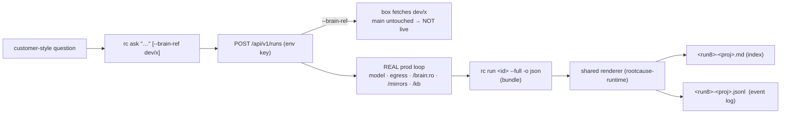

# Spec — Brain test runs (kit side: shared renderer + brain-dev playbook)

**Repo:** `rootcause-brain-skills` (the kit). This repo owns (a) the **one** index+JSONL **renderer**
shipped in the `rootcause-runtime` package, and (b) the **`brain-dev` skill** that teaches the
self-service run + dev-ref test loop from inside a brain.

- Server contract (endpoints, test-run semantics): [`../../rootcause/docs/specs/brain-test-runs.md`](../../../rootcause/docs/specs/brain-test-runs.md)
- CLI (`rc ask`, `rc run --full`): [`../../rootcause-cli/docs/specs/brain-test-runs.md`](../../../rootcause-cli/docs/specs/brain-test-runs.md)

## The two capabilities, from inside a brain



## The fidelity ladder (where each tier fits — and why we stop here)

| Tier | Tests | Fidelity | Push? | Owner |
|---|---|---|---|---|
| `brain_run.py` (`uv`) | one grounding script, real read-only DB | imports + per-project env | none | brain-dev (exists) |
| `brain_run.py` (`docker`) | one grounding script in real sandbox (mounts, deps, EROFS) | sandbox-faithful | none | brain-dev (exists) |
| **`rc ask --brain-ref dev/x`** | **the whole LLM loop on real infra** | **prod-identical** | a `dev/*` branch only — **`main` untouched** | this feature |
| `rc_agent_run.sh` (operator) | whole loop on `main` | prod | `main` = **live** | rootcause |

> **Why no "full loop in local Docker" tier.** The agent loop (two-tool orchestration, warm-start,
> grounding pre-pass, system-prompt assembly, model calls, egress gateway, KB tenant-scoping, PII
> vault) is **host code in rootcause** and, by AGENTS.md's litmus ("does it touch OUR host?"),
> must not be vendored here. Shipping it to run locally would recreate the **lib-drift trap as
> loop-drift**: a green local loop against a stale copy is a *false* green. The `--brain-ref` run *is*
> the high-fidelity loop test — it reuses the actual prod loop. Local Docker stays the fast inner loop
> for **grounding scripts only**. (KB + mirrors are the smaller half of the fidelity gap; the loop is
> the larger half — both vanish when you test on prod infra.)

## Change 1 — the shared renderer ships in `rootcause-runtime`

Decision (c): **one renderer, brain-side, importable by both the operator script and the brain-dev
script.** The clean packaging is a dump-only module inside the already-pinned `rootcause-runtime`
package — it lives with the brain world, prod's run image never imports it, and both consumers pull
identical bytes via the existing git tag pin (the same anti-drift mechanism we use for `lib`).

Add `runtime/lib/run_dump/` (new submodule; **not** imported by any grounding/run path):

- `render_index(bundle) -> str` — the markdown index (topic, question, outcome gists, warm-start
  block, trimmed system-prompt block, grounding pre-step, timeline of substantive steps, auto-flags,
  egress summary, trace URL, jq drill-down block).
- `emit_jsonl(bundle) -> Iterable[str]` — line 1 `{"type":"run",…}` header (untrimmed system_prompt +
  full draft/notes/proposed_actions + egress), then `{"type":"event",…}` per tool call keyed by `disp`.
- `decorate(events)`, `flags(bundle)`, `files_read(events)` — presentation helpers (the `disp`/`label`
  computation, `P1,P2…` grounding labels, anomaly detection, "files read" extraction). **The server
  ships raw truth; these decorate it.** Port verbatim from `rc_agent_debug.py` so output is identical.

Input is the **bundle dict** defined in the server spec (`{run:{…}, events:[…]}`), which equals
`rc run <id> --full -o json`. Both fetch backends normalize to it:

- **dev/project path (this repo):** `fetch_via_api()` shells `rc run <id> --full -o json` (or calls
  `/full` directly with `ROOTCAUSE_API_KEY`).
- **operator path (rootcause):** `rc_agent_debug.py`'s existing SSM `fetch_via_db()` → same dict.

Version: bump the `rootcause-runtime` tag when the renderer or the bundle contract changes; move the
`rc-cli` `/full` contract version with it (see RELEASING.md — keep plugin tag, runtime pin, image tag,
prod Dockerfile pin moving together).

## Change 2 — `brain-dev` skill: the run + dump + dev-ref loop

Add a thin script `skills/brain-dev/scripts/brain_dump.py` and a SKILL section / playbook page:

```bash
# trigger a run from a customer question (against main HEAD)
rc ask "Hi, my account is sophie.coca-cola.com. Do I still have open invoices?"

# OR test a brain change without pushing main:
git push origin dev/refund-rework                 # dev branch — main stays live
rc ask "<customer question>" --brain-ref dev/refund-rework

# then dump the run to the two local files (index + jsonl), then jq the detail
uv run "$SKILL/scripts/brain_dump.py" <run_id>    # writes <run8>-<proj>.md + .jsonl
jq -r 'select(.disp=="23").command' <file>.jsonl  # progressive disclosure: drill into a step
```

`brain_dump.py` = `fetch_via_api()` → `run_dump` renderer → write both files (gitignored `.rootcause/dump/`,
under the wholesale-ignored `.rootcause/` artifact dir). It is **infra-free** (public API + env key only),
so it rightfully ships here, not in rootcause.

Playbook beats to document in the skill:
- **Side-effect freedom**: a `--brain-ref` run posts no callback and pushes no journal; actions/PRs are
  proposed **but flagged `test`** — so "did the agent reach for the action?" (Mode A) still works.
- **Boundary**: mirrors + KB are at their current cron-synced versions; you're testing *brain* changes.
- **It does not replace** `ship-and-verify.md` — that's the path to make a change *live* on `main`. This
  is the path to *gain confidence on real infra first*.

## Change 3 — docs wiring

- [`docs/rc-cli.md`](../rc-cli.md): add `rc ask` + `rc run <id> --full` to the command list; note `rc
  ask --brain-ref` as the no-push prod test; bump the documented version once `rc-cli` publishes.
- [`docs/actions.md`](../actions.md) / [`skills/brain-dev/ship-and-verify.md`](../../skills/brain-dev/ship-and-verify.md):
  cross-link — `rc ask --brain-ref` is now the project-dev's Mode A that needs **no operator/SSM
  access** and **no main push** (today Mode A is operator-only `rc_agent_run.sh`).
- AGENTS.md "Ships here" table: add the run-dump renderer (`rootcause-runtime`) + `brain_dump.py` as
  infra-free, customer-world-facing tooling that correctly lives here.

## Acceptance

1. From a brain repo with only `ROOTCAUSE_API_KEY`/`ROOTCAUSE_BASE_URL`: `rc ask "<q>"` returns a run
   and `brain_dump.py <run_id>` writes an index `.md` + `.jsonl` pair.
2. `rc ask "<q>" --brain-ref dev/x` runs against the pushed dev branch (verify the dump's `brain_ref`
   echoes `dev/x`), with `main` unchanged and no journal pushed.
3. The renderer output for a given run is **byte-identical** whether fed by `fetch_via_api` (here) or
   `fetch_via_db` (operator `rc_agent_debug.py`) — the DRY guarantee.
